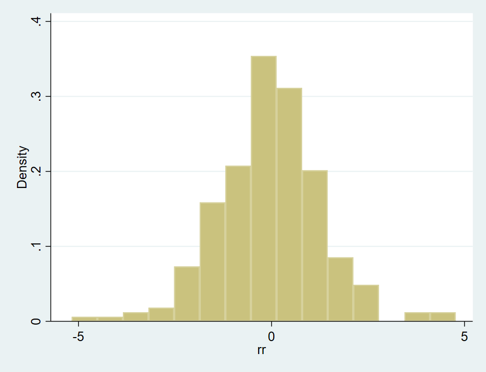
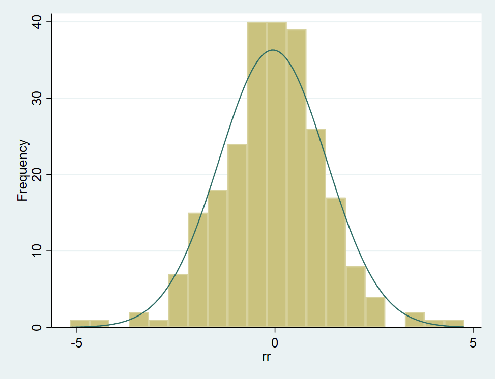
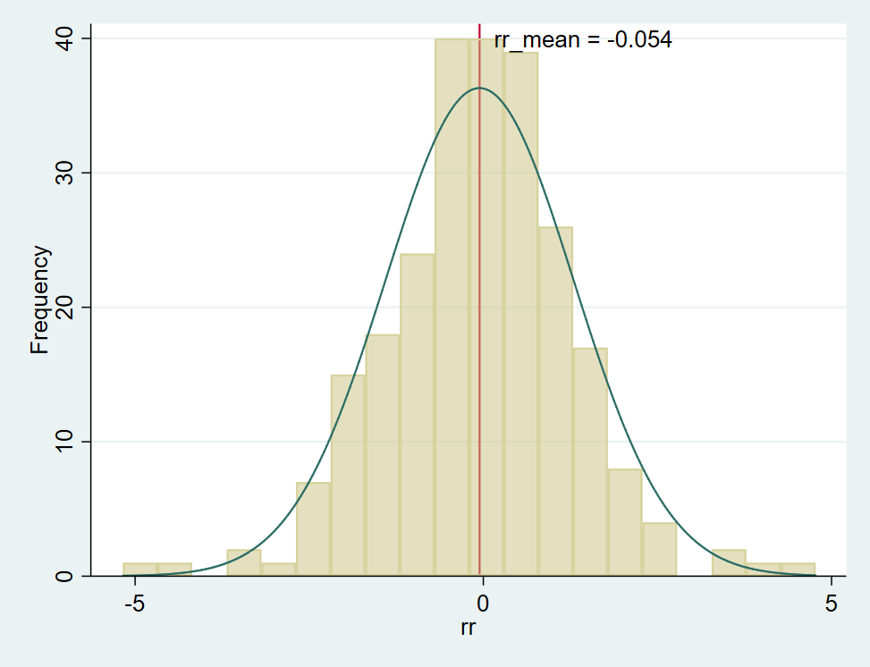
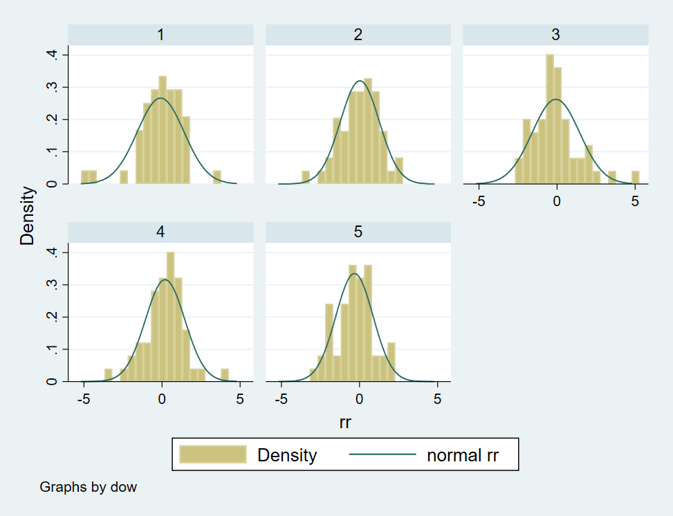
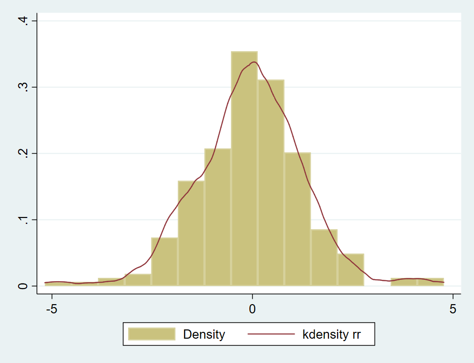
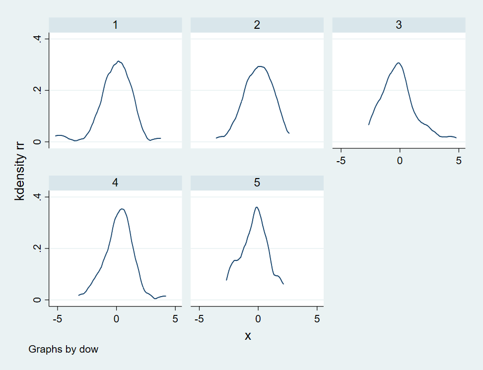
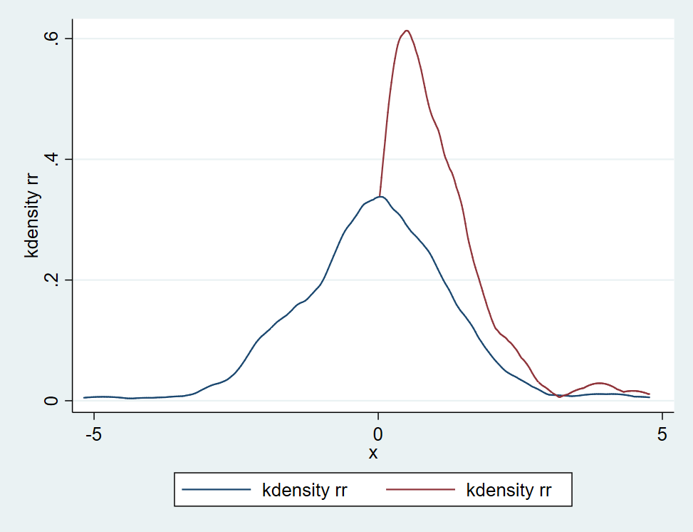
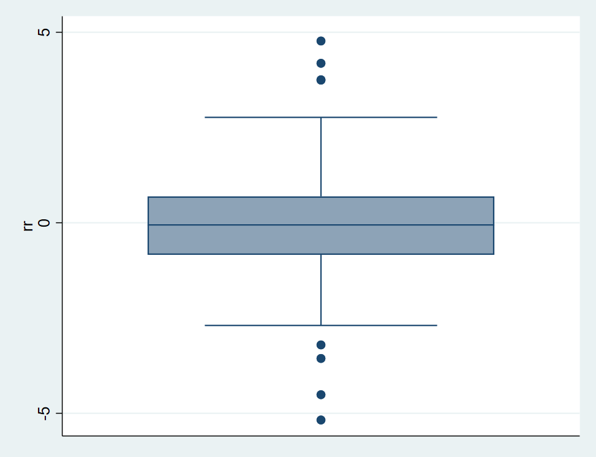
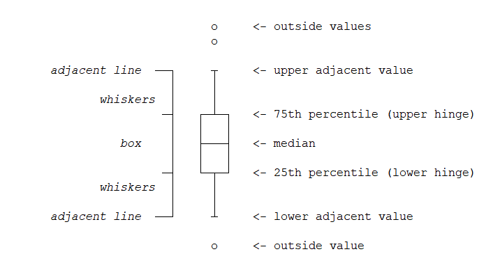
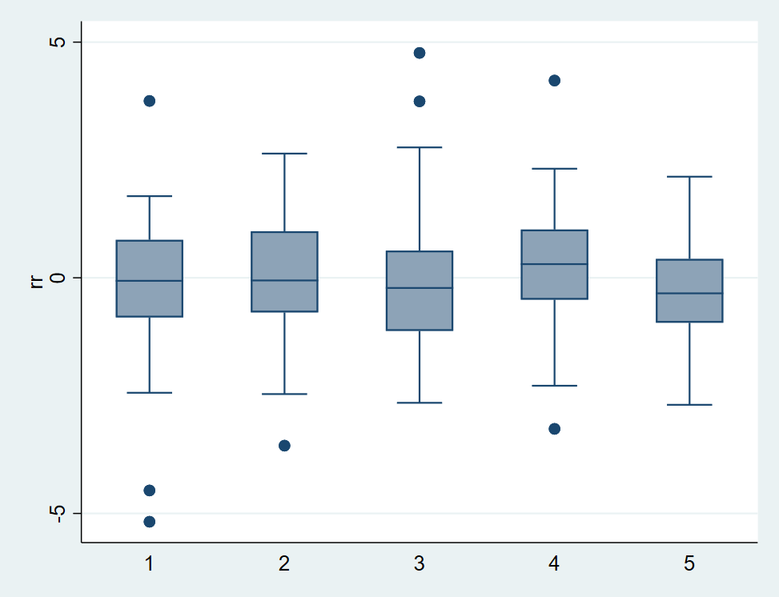

本篇将介绍用于展示**数据分布特征**的常用的三种类型的图形。

### 提要
[TOC]

### 0. 写在前面

从这一篇开始，我们将会将所用到的代码和数据托管至github，地址是：**https://github.com/zhangdashenqi/Stata-Graph**。欢迎star！

你也可以使用Stata中的`copy`命令将github中的`.do`文件拷贝至本地，然后进行编辑。

以拷贝本篇的`.do`文件为例：
```JavaScript
copy "https://raw.githubusercontent.com/zhangdashenqi/Stata-Graph/master/data_distribution.do" "data_distribution.do"
doedit plot_distribution.do
```

后续我们会将之前的推文的原代码和数据整理后push至github。敬请关注。

### 1. 直方图

还是用Stata自带的标准普尔500数据为例：
```JavaScript
sysuse sp500.dta, replace

gen rr = change / close * 100    // 收益率
gen dow = dow(date) 			 // 星期几
```

变量`rr`代表日收益率，`dow`表示星期几。

在Stata中，采用`histogram`绘制数据的直方图，默认绘制密度分布直方图：

```JavaScript
histogram rr
```
结果如下：



`histogram`也可以附加很多选项，例如用`bin()`设置直方的数量，`frequency`表示统计的是频数（默认是密度），`normal`用于附加一个正态分布曲线。

```JavaScript
histogram rr, bin(20) frequency normal
```

结果如下：



同样，我们可以使用`xline()`选项附加一条竖线，比如附加其均值线：

```Java
sum rr
local rr_mean : dis %4.3f r(mean)
histogram rr, bin(20) frequency normal  ///
	xline(`rr_mean') fcolor(%50)        ///
	text(40 0 "rr_mean = `rr_mean'", place(east))
```

`fcolor(50%)`用于设置直方图的不透明度为50%，`text()`用于在图形上附加文本信息。效果如下：




同样，我们也可以附加`by()`选项，`by(dow)`用于分别绘制周一至周五的收益率的直方图：

```Java
histogram rr, bin(20) normal by(dow) legend(row(1))
```



还有一些外部的Stata命令可以绘制双变量直方图，可参考：

```Java
ssc install bihist
help bihist
```

### 2. 核密度图

在Stata中，采用`kdensity`命令来绘制数据的核密度图：
```Java
kdensity rr, normal
```

同样，`normal`用于附加一个正态分布的曲线，结果如下:


我们也可以绘制出直方图，然后附加核密度图：
```Java
twoway histogram rr || kdensity rr
histogram rr, kdensity   // 效果同上
```

上述两条命的效果是一样的。



同样，可以附加`by(dow)`用来分别绘制周一至周五的收益率的核密度图：



现实中的一些数据往往会出现截断的特征，截断之后由于数据分布发生了变化，如果还采用原来的回归模型进行回归，可能会出现偏差。我们以下图来说明数据从0处截断时的分布：

```Java
twoway kdensity rr || kdensity rr if rr>0
```



可以看到，收益率数据在0处截断，其分布出现了较大的变化。如果不事先考察数据的分布而直接进行回归，无异于是耍流氓。

### 3. 箱型图

我们介绍另一个常用于描述数据分布——箱型图，它使用`graph box`命令进行绘制。

```Java
graph box rr
```
结果如下：



箱型图绘制较为简单，但是对其理解还有一点难度。



如上图所示，箱体的中心线对应于数据的中位数，箱体的上下边分别对应数据75分位和25分位的值；上下引线分别对应于上下临界值，超出临界值的数据则为**离群值**。

那么上下临界值是多少呢？在这里要提及一个概念：**四分位间距(interquartile range, iqr)**，四分位间距等于75分位的值减去25分位的值，即**iqr = p75 - p25**。那么**上临界值（upper adjacent value）= p75 + 1.5 * iqr**，**下临界值（lower adjacent value）则为= p25 - 1.5 * iqr**。

箱型图不仅可以附加`by()`选项，还可以附加`over()`选项：

```Java
graph box rr, over(dow)
```



箱型图常用于判断是否存在离群值，但离群值的判断方法并不止这一种，后面我们会详细介绍。

