前面几篇文章中，我们介绍了Stata中用于做透视表的collapse命令，以及与此相关的另外三个命令：`tabstat`、`tabulate`以及`table`。这一篇我们将介绍三种常用的数据统计类图表。

### 提要

[toc]

在正式介绍之前，先做以下说明：

以下演示数据来源于银监会网站（http://xukezheng.cbrc.gov.cn/ilicence/licence/licenceQuery.jsp）中的银行机构退出列表；以下所有的示例均是在下述数据处理的基础上进行的。

```
import excel "机构退出列表.xls", sheet("许可证情况导出") firstrow clear
drop 经度 纬度 机构地址
gen year = yofd(date(批准成立日期, "YMD"))         // 银行分支机构成立年份
gen quit_year = yofd(date(发生日期, "YMD"))       // 银行分支机构退出年份
gen age = quit_year - year + 1                   // 存续时间
```

### 1. 柱状图

在Stata中，柱状图包括竖直的柱状图和水平的柱状图，它们分别采用`graph bar`和`graph hbar`命令进行绘制。由于它们的用法大致相同，因此我们进行统一地介绍。

如果我们想统计每年究竟有多少个银行机构退出，那么不用先费力地先统计出这些数字，而是让Stata帮你一步完成：

```
graph bar (count) 流水号, over(quit_year) blabel(total)
```

选项`(count)`表示统计变量流水号出现的个数，`over()`用于指定分组的变量，`blabel()`表示bar标签显示内容，`total`即指定了显示bar的累积高度。

结果如下：

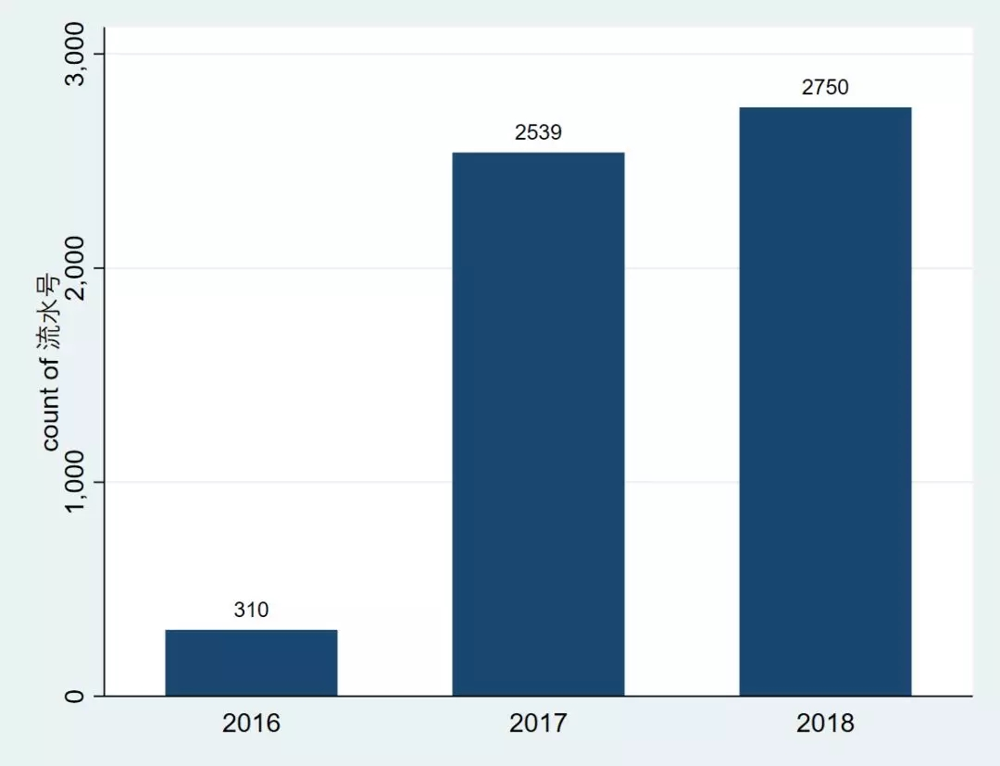

我们也可以不用统计变量流水号出现的次数，为了后面方便起见，我们生成一个值全为1的`bank`变量，下面代码的效果跟上例是一样的。

```
gen bank = 1
graph bar (count) bank, over(quit_year) blabel(total)
```

当然，我们也可以按照两个变量进行分类展示，例如统计北京和上海的银行机构退出情况：

```
graph bar (count) bank if (省份=="北京"|省份=="上海"),  ///
    over(quit_year) over(省份) blabel(total)
```

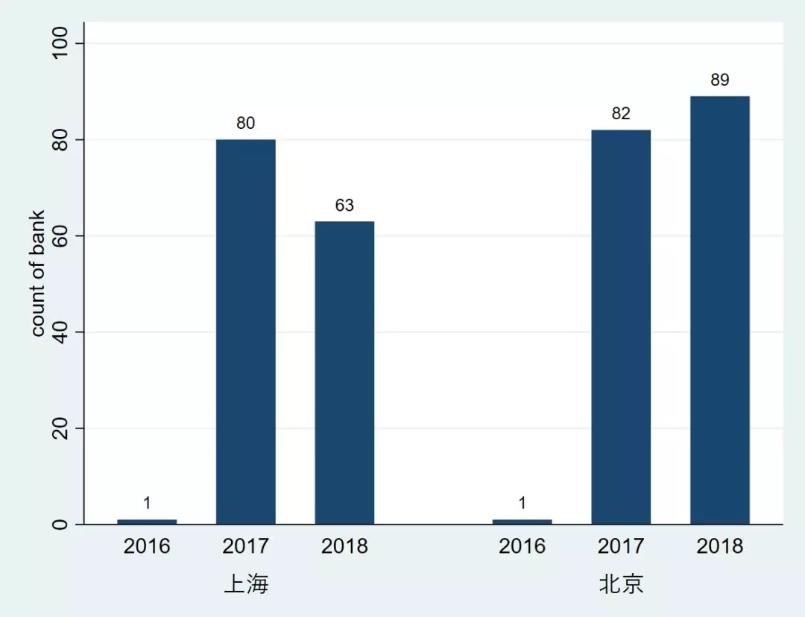

调换分组的变量的顺序，注意结果：

```
graph bar (count) bank if (省份=="北京"|省份=="上海"),  ///
    over(省份) over(quit_year)  blabel(total) 
```

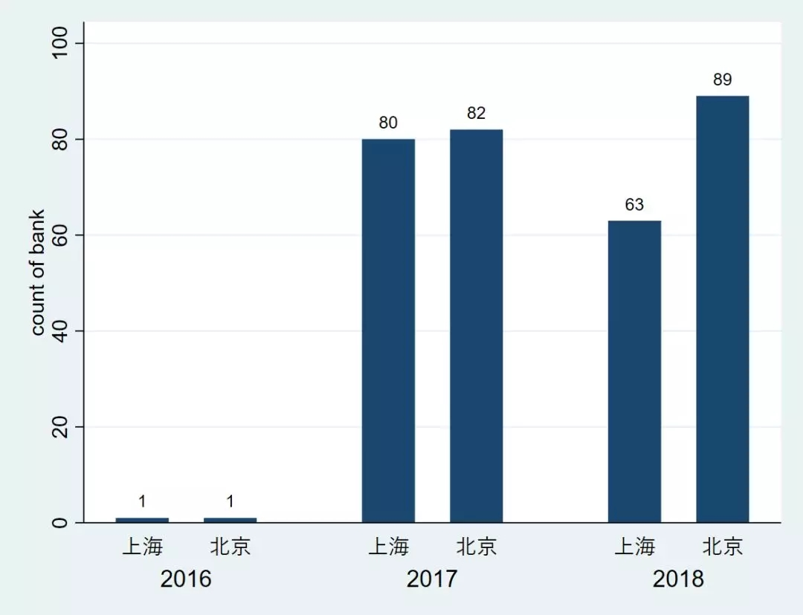

如果我们想统计这几年退出机构的平均年龄，可以：

```
graph bar (mean) age, over(quit_year) blabel(total)
```

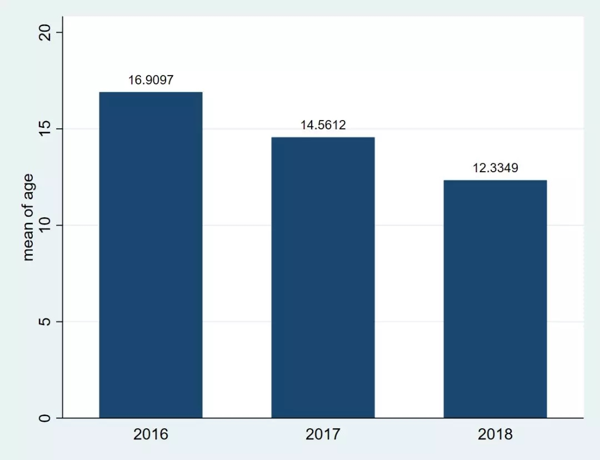

可以看出，退出机构的年龄越来越短了。

由于`graph hbar`与`graph bar`的用法基本相同，就不再一一赘述了。

有人总是嫌弃Stata绘出的图形比较丑。事实上，只要你稍微花费一点心思，就可以做出好看的图了。以`graph hbar`为例：

```
graph hbar (count) bank if (省份=="北京"|省份=="上海"),    ///
    over(quit_year) blabel(total) ytitle("")             ///
    bar(1, fcolor(green) fintensity(30)) bargap(5)       ///
    by(省份, title("银行分支机构退出情况")                 ///
             note("数据来源：中国银行业监督管理委员会"))    ///
    scheme(s1color)
```

这一次，我们没有将类别变量省份放到`over()`中，而是使用了`by()`选项，它表示按照省份进行绘制图形，结果如下：

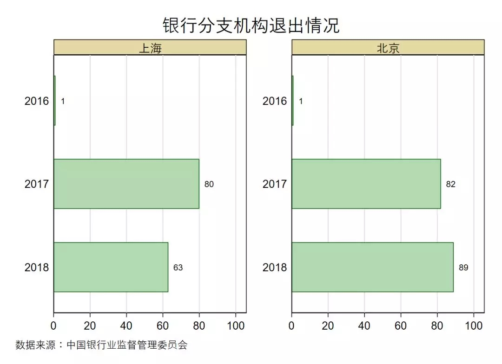


### 2. 饼状图

如果我们想要统计每一年退出机构的占比，用饼状图是再恰当不过了：

```
graph pie bank, over(quit_year) plabel(_all percent, format(%4.2f))
```

它的绘制跟`graph bar`的差不多。`plabel`表示每个pie的标签，`_all`表示所有的分组，`percent`表示占比，`format()`用于表示显示数字的格式：

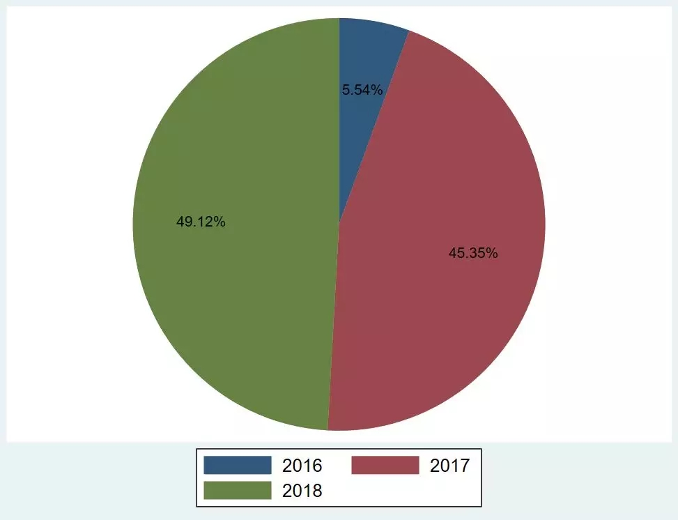

如果你花一点心思，它还可以更漂亮些：

```
graph pie bank, over(quit_year)                             ///
    plabel(_all percent, format(%4.2f) color(white))        ///
    legend(row(3) ring(0) symxsize(*0.5) size(*0.8) pos(1)) ///
    scheme(s1color)                                         ///
    title("银行分支机构退出情况")                             ///
    note("数据来源：中国银行业监督管理委员会")
```	

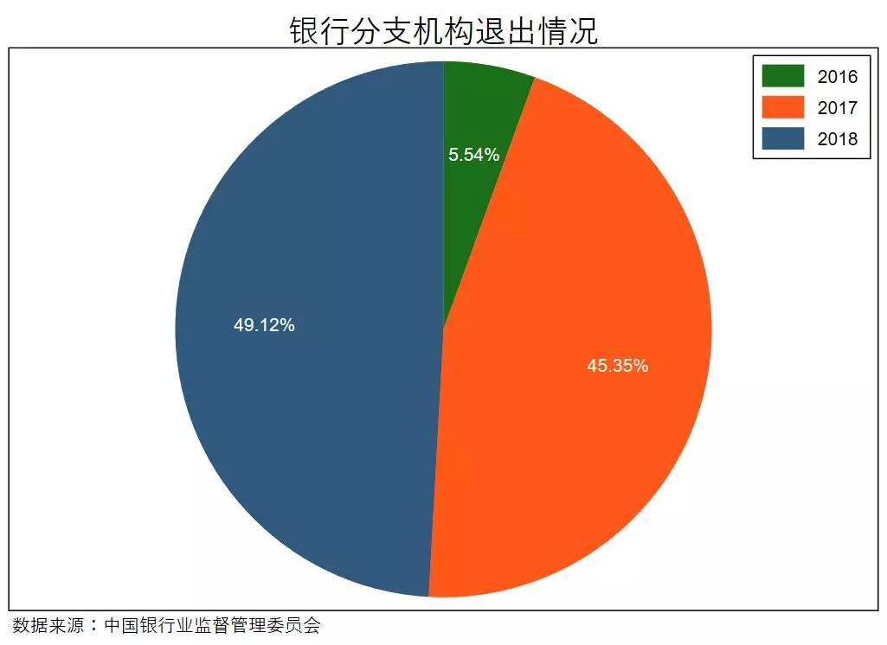

饼状图同样可以分组绘制：

```
graph pie bank if (省份=="北京"|省份=="上海"),                 ///
    over(quit_year)                                         ///
    plabel(_all name, color(white))                         ///
    by(省份, title("银行分支机构退出情况")                  ///
             note("数据来源：中国银行业监督管理委员会")      ///
             legend(off))                                   /// 
    scheme(s1color)
```

这一次，我们在pie标签中只显示它的名称，而不是占比：

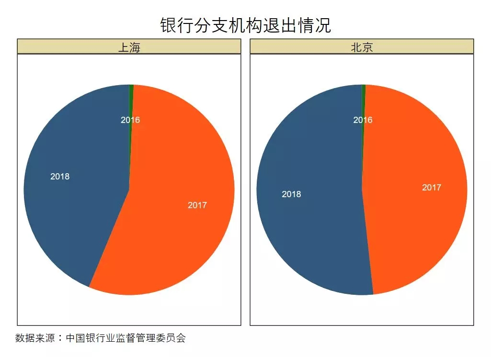

### 3. 点状图

这里的点状图不是散点图（`scatter`），我们用例子来说明。它的用法与`graph bar`及`graph pie`差不多：

```
graph dot (count) bank, over(quit_year)
```

同样是统计每年退出机构的数量：

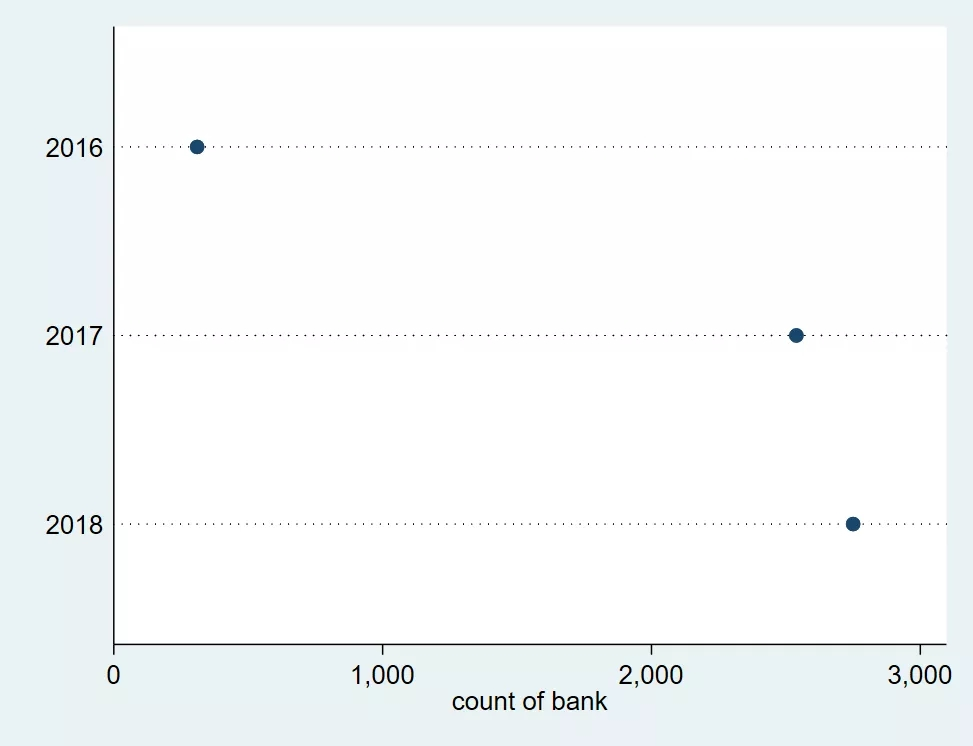

点状图可以同时指定多个统计值，比如我们想统计每年退出机构的年龄的平均值以及中位数：

```
graph dot (mean) age (median) age, over(quit_year)
```

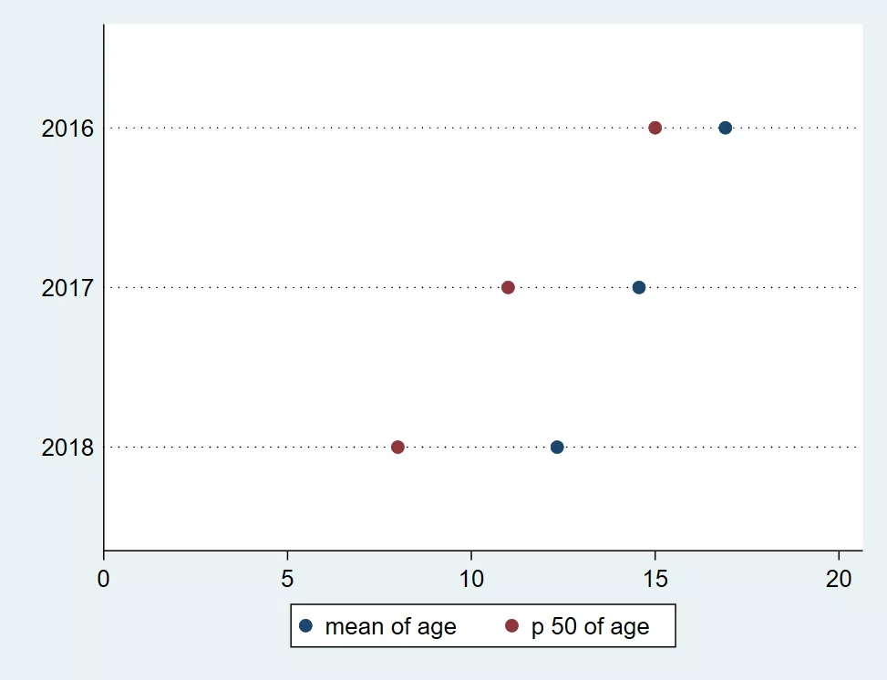

那么只统计北京和上海的情况呢？

```
graph dot (mean) age (median) age if (省份=="北京"|省份=="上海"),     ///
    over(省份) over(quit_year)                                    ///
    marker(1, msymbol(Oh)) marker(2, msymbol(Dh))                   ///
    title("银行分支结构退出时的年龄")
```

`maker`用于设定图中标示块性质，`msymbol(Oh)`表示maker symbol为空心（hollow）圆圈（O），`msymbol(Dh)`表示maker symbol为空心（hollow）菱形（diamond）。

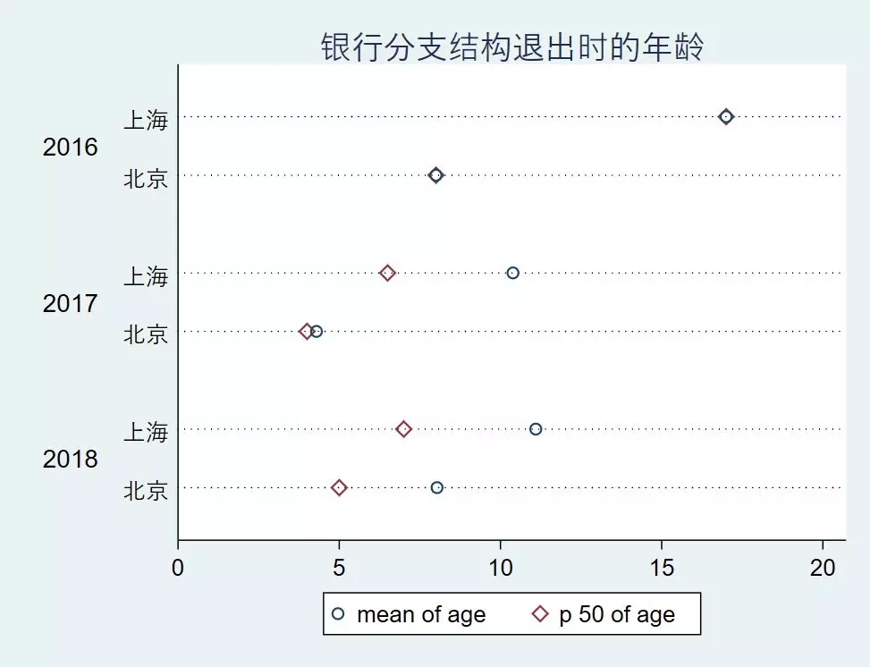

如果用`by()`选项呢？

```
graph dot (mean) age (median) age if (省份=="北京"|省份=="上海"),     ///
    over(quit_year) marker(1, msymbol(Oh)) marker(2, msymbol(Dh))   ///
    by(省份, title("银行分支结构退出时的年龄")                        ///
             note("数据来源：中国银行业监督管理委员会")          ///
             legend(off))                                           /// 
    scheme(s1color) 
```

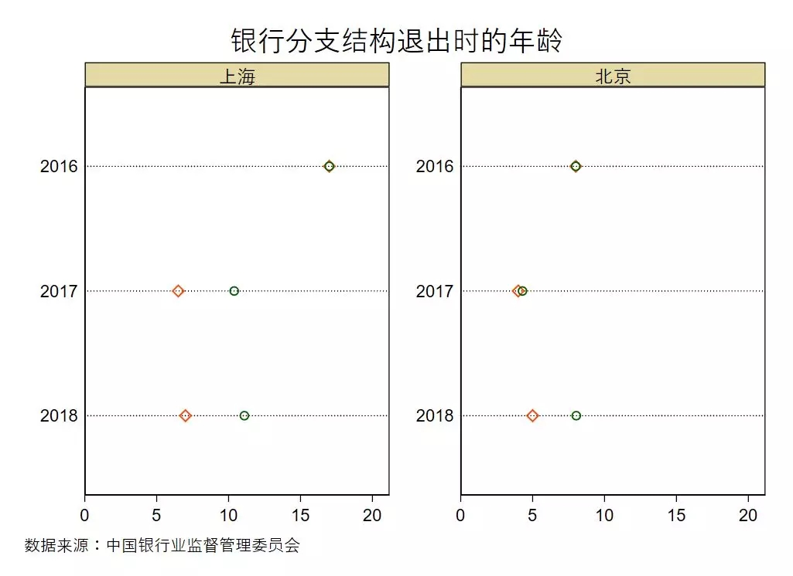
