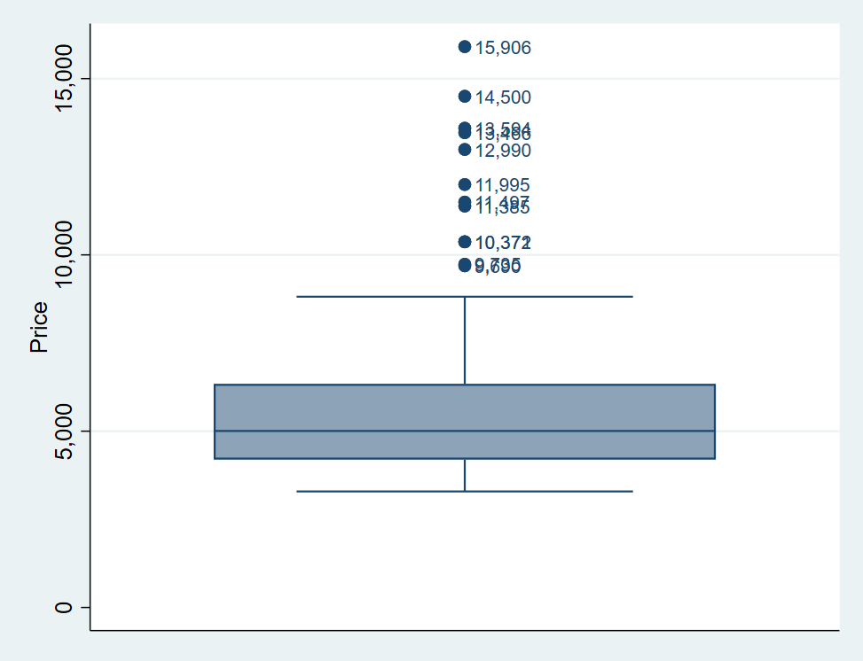
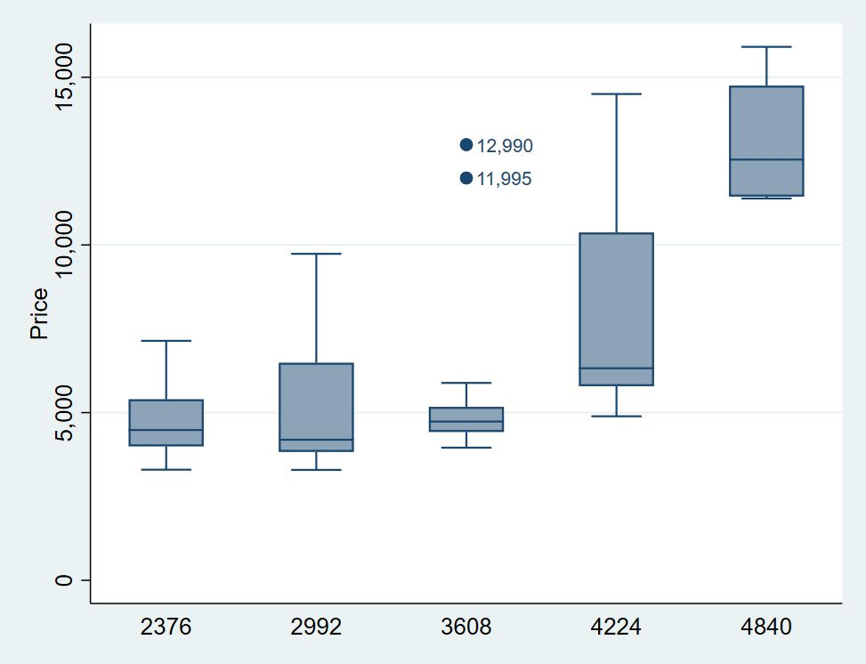
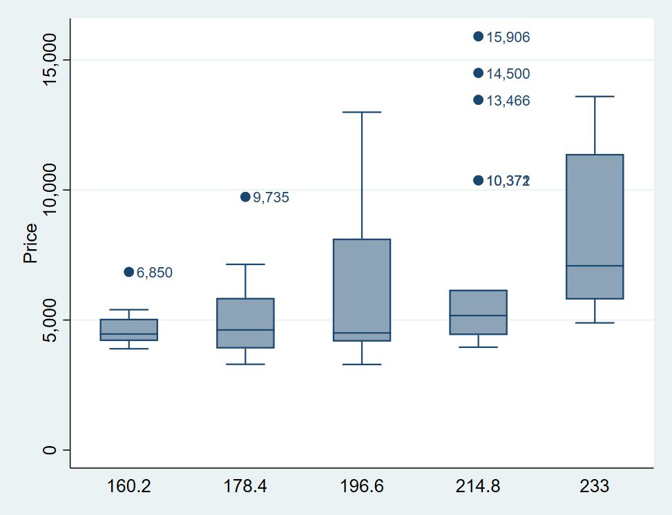
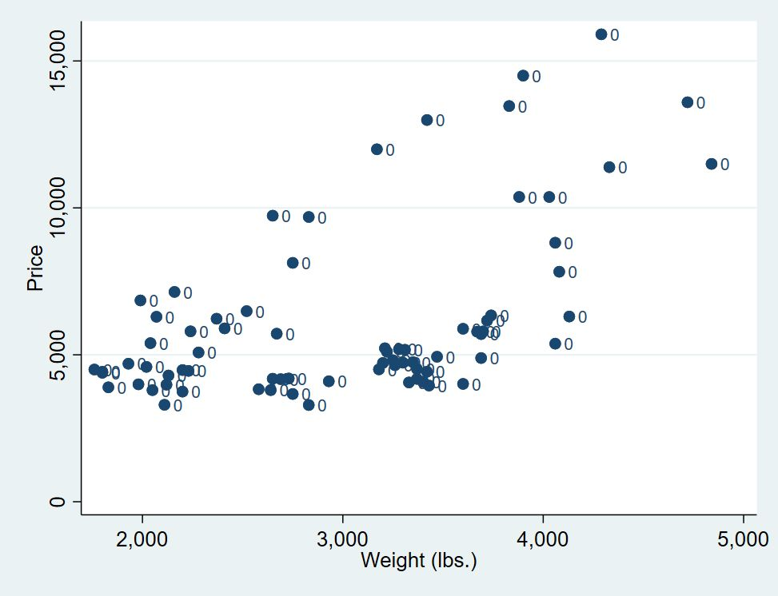
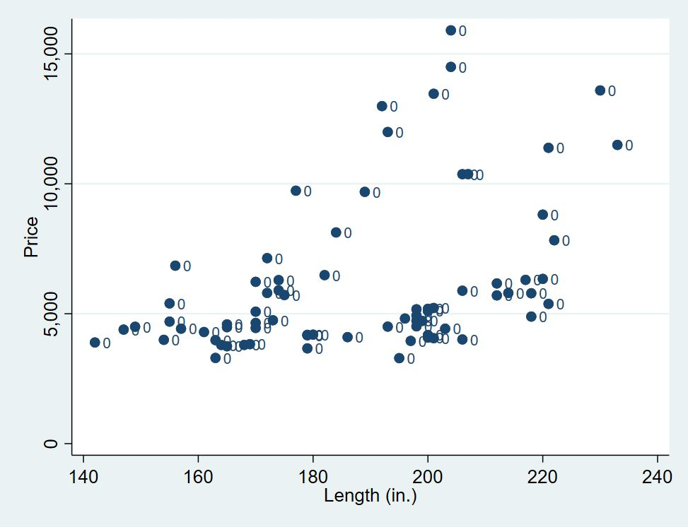
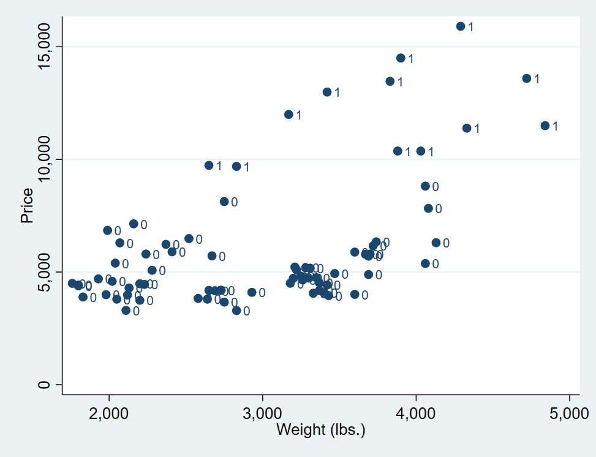

在上一篇文章的最后，我们简单提及了**离群值（outliers）**（或称之为异常值）。“**关于离群值的两个重要问题就是：‘如何找到它们？’以及‘如何处理它们？’**”（“The two big questions about outliers are ‘how do you find them?’ and ‘what do you
do about them?’” (Ord, 1996)）。本文将讨论第一个问题。

### 提要

[toc]

### 1. 箱型图（box）

在上一篇文章的最后，我们介绍了箱型图的绘制，并简单提及了箱型图可以用来检测离群值的。

我们用Stata自带的`auto.dta`数据进行说明。导入该数据集之后，绘制出汽车价格`price`的箱型图。

```java
sysuse auto.dta, clear
graph box price, marker(1, mlabel(price))
```

其中，`marker()`选项用于设定位于箱体上下引线之外的值（outside values）的外型，在这里我们给这些值添加了标签，标签上的值为其价格。结果如下：



可以看到，变量`price`有许多超过箱体上引线的值：这些outside values最大的为15906，最小的为9690。那么这些值是离群值么？

从生活常识上来说，如果一辆奥迪的售价是100万，我们一点也不会吃惊；而如果一辆奥拓的售价为100万，估计就可以上热搜了。

这就表明，**单纯地从某一个变量的分布特征来判断其是否为离群值是有失偏颇的。**

因此，我们可以结合其他变量来判断某些值是否是离群值。


### 2. 双变量箱型图

根据最基本的常识（不一定对），一辆汽车越重，越长，则它的价格可能就越贵。

因此我们可以绘制一个根据汽车重量（或长度）来进行分类的箱型图，也就是**双变量箱型图**。

在这份数据中，汽车的重量`weight`和长度`length`都是连续变量，因此我们首先得**将连续变量转变成类别变量**。

```java
sysuse auto.dta, clear
sum weight
local w_min = r(min)
local w_max = r(max)
gen wei_cat = autocode(weight, 5, `w_min', `w_max') // 生成类别变量
graph box price, over(wei_cat) marker(1, mlabel(price))
```

第5行中，我们使用`autocode()`函数用于自动生成类别变量，在我们的设定中，它将会根据最小值`w_min`和最大值`w_max`将变量`weight`生成`5`组类别变量。（具体要分成几组，可以自由决定）

第6行中，我们绘制出两个变量的箱型图。结果如下：



这次我们找到的离群值没有第一次多了，只有在第3组中，也即汽车重量位于2992~3608之间的汽车中，只有两个离群值。看来，这个吨位的汽车，承受了它不应该有的高价格。

我们再结合汽车长度来进行判断：

```java
sysuse auto.dta, clear
sort length
gen len_cat = autocode(length, 5, length[1], length[_N])
graph box price, over(len_cat) marker(1, mlabel(price))
```

这一次生成类别变量的操作中，我们没有使用暂元，而是先使用`sort`命令进行排序，则`length`的最小值为`length[1]`，最大值为`length[_N]`。

结果如下：



这一次的离群值又多了起来，而车身长度为与196.6~214.8之间的尤其多。

### 3. 多元变量检测

既然我们可以根据另一个相关变量来检测离群值，自然而然，我们也可以结合多个相关变量来进行判断，例如结合`weight`和`length`，甚至更多的相关变量。

在这之前，我们首先介绍一个Stata外部命令`bacon`。它是根据Billor, Hadi, and Velleman (2000)提出的用于检测离群值的the blocked adaptive computationally efficient outlier nominators （BACON）来命名的。关于`bacon`的原理可参考文章后面的参考文献。

首先，安装它：

```java
ssc install bacon    // 安装bacon
help bacon           // 查看帮助文件
```

然后，我们先用单变量进行检测：

```java
sysuse auto.dta, clear
bacon price weight, gen(wei_bac) p(10) replace
scatter price weight, ml(wei_bac)
```

第2行，我们还是用`weight`来检测`price`，然后生成`wei_bac`的虚拟变量，如果该值是离群值，为1；否则为0。`p(10)`表示10%的显著水平。结果如下：

```
Total number of observations:          74
   BACON outliers (p = 0.10):           0
      Non-outliers remaining:          74

```

第3行，我们绘制出散点图，并用`wei_bac`来标记点。



```
Total number of observations:          74
   BACON outliers (p = 0.10):           0
      Non-outliers remaining:          74
```

同样，根据`length`来检测离群值：

```java
bacon price length, gen(len_bac) p(10) replace
scatter price length, ml(len_bac)
```
结果如下：



可以看出，**采用`bacon`方法，不论使用`weight`，还是`length`，在10%的显著水平下，都没有离群值**。

与`bacon`命令功能一致的还有`hadimvo`命令，关于这两个命令的异同，由读者朋友自己探索，这里之列示其结果：

```java
hadimvo price weight, gen(wei_hadi) p(10)
scatter price weight, mlabel(wei_hadi)

hadimvo price length, gen(len_hadi) p(10)
scatter price length, mlabel(len_hadi)
```

其绘图结果如下：




可以看出，**采用`hadimvo`命令，不论是使用`weight`，还是`length`，在10%的显著水平下，都有12个离群值**。

那么，对于**多变量的离群值检测**，其操作基本同上：

```java
bacon price weight length, gen(out_bac) p(10) replace
```
结果如下：
```
Total number of observations:          74
   BACON outliers (p = 0.10):           0
      Non-outliers remaining:          74
```

表明不存在离群值。


### 4. 另一个例子

我们在github上托管了本篇文章所用到的do文件，那里面还有一个88年妇女工资的例子，你可以自由探索。传送门：https://github.com/zhangdashenqi/Stata-Graph


### 5. 总结

我们介绍了几种用于检测离群值的方法，他们得到的结果不尽相同。这表明，对于离群值的界定就是相当主观的。你用不同的尺子就会得到不同的结果。

`bacon`命令是一个根据多元数据进行离群值检测的方法，它的另一个优势就是快——这是因为它采用了mata编程。

**参考文献**
[1] Weber, Sylvain. “Bacon: An Effective Way to Detect Outliers in Multivariate Data Using Stata (and Mata).” The Stata Journal,vol. 10, no. 3, Sept. 2010, pp. 331–338
[2] Hadi, A. S. 1992. Identifying multiple outliers in multivariate data. Journal of the Royal Statistical Society, Series B 54: 761–771.