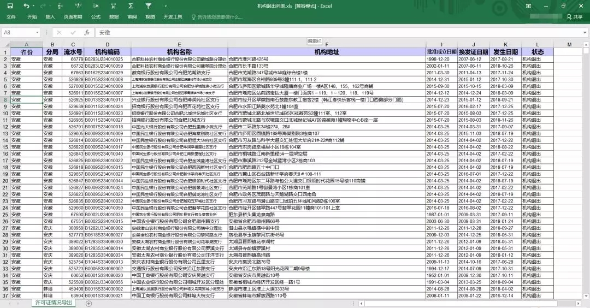
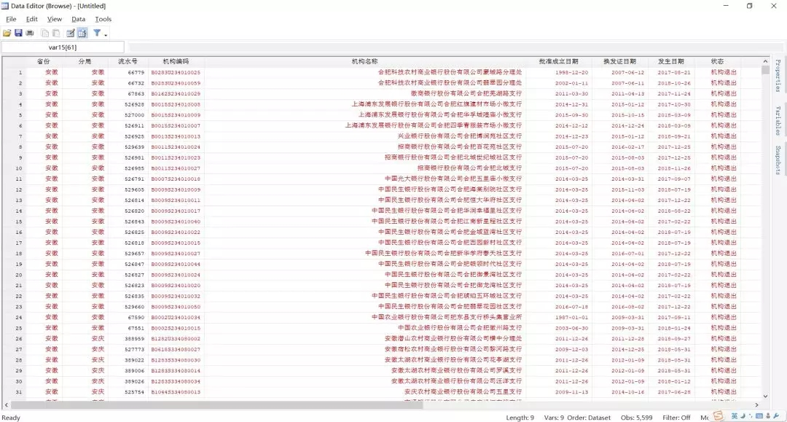
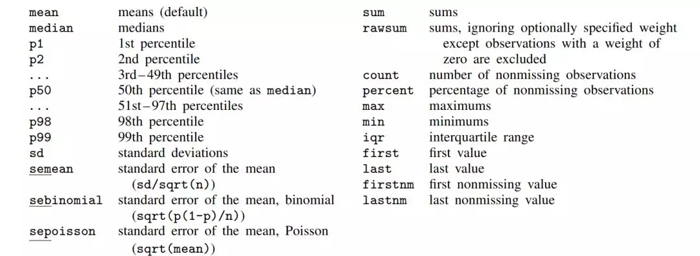
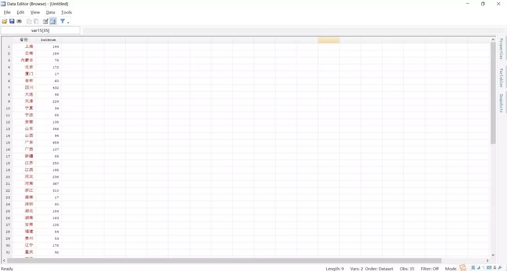
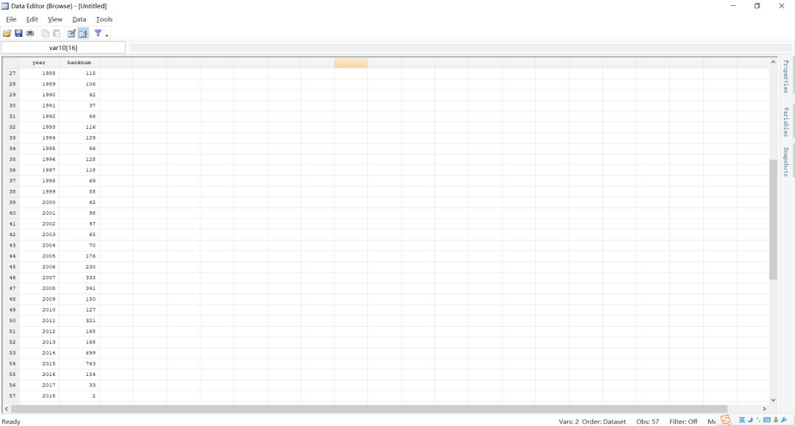
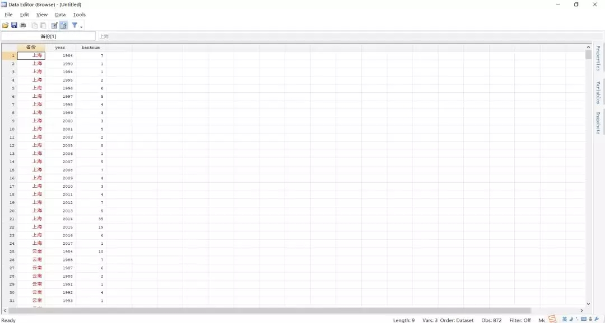
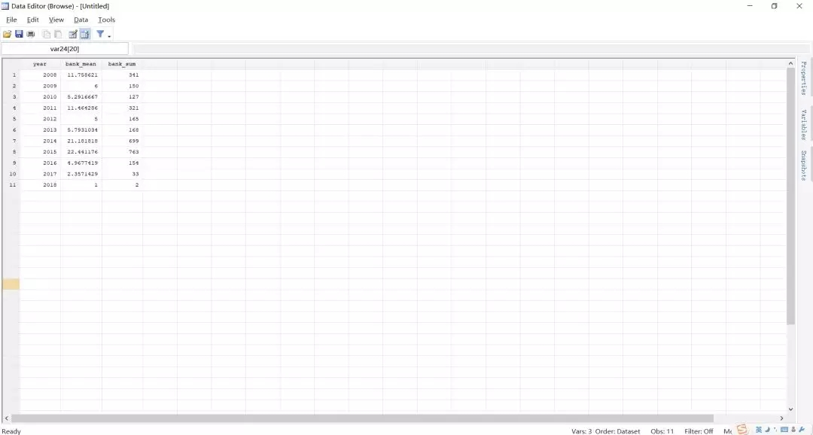
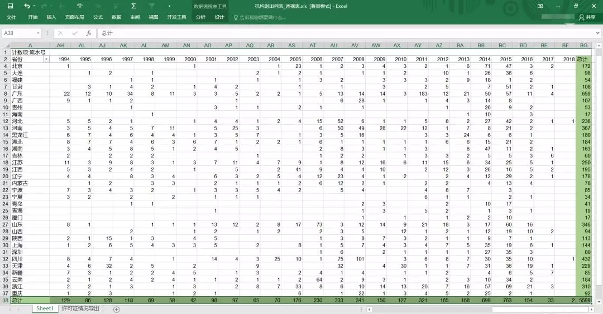

透视表是我们使用Excel必备的一个技能。然而，Stata也可以方便快捷地做出透视表。

### 提要

[toc]

### 1. 一个问题

我们从银监会网站（http://xukezheng.cbrc.gov.cn/ilicence/licence/licenceQuery.jsp）上下载了一份关于银行许可证的统计信息表。该表记录了近两年内金融机构退出的情况。



我们将其导入Stata中，发现有5599笔观测值。



现在的问题是，我们打算按照年份或者省份进行数据的统计。

显然这个问题使用Excel中的透视表功能将可以很方便地实现。**那么Stata如何实现透视表的功能呢？**

### 2. 用Stata做透视表

使用Stata做透视表比Excel更加简单――只需一行命令。这一篇我们将主要介绍`collapse`命令。

#### 2.1 命令介绍

`collapse`命令用于将一个数据集中的若干**数字变量**转换为其平均值、总和、中位数等统计值形式。注意，要转换的变量一定是**数字变量**，字符串，时间等形式的变量不能转换。

它的常用用法如下：

`collapse clist, by(varlist)`

这里的`clist`代表：


`varlist`或`varname`是我们要进行统计的变量，`target_var`是统计后生成的变量名。`(stat)`用于指定统计何种指标，比如说，均值、中位数、分位数、计数、总和等。`(stat)`默认为均值。该命令支持的所有统计指标如下：



`by()`选项用于指定用于分组的变量，比如年份、省份等等。

下面我们进行演示说明。

#### 2.2 示例：按省份统计

我们先对数据进行简单处理，导入数据、删除无关变量以及生成年份数据。

```javascript
import excel "机构退出列表.xls", sheet("许可证情况导出") firstrow clear
drop 经度 纬度 机构地址
gen year = yofd(date(批准成立日期, "YMD"))
```
以下所有的示例都是在这3行代码的基础上进行，在此一并说明。

如果我们只是想按照省份进行统计银行个数，那么参数`stat`应该指定为`count`，`banknum`是我们新生成的变量名，`流水号`是我们要统计的变量，`by(省份)`表明我们是根据省份进行分组统计的。

```javascript
collapse (count) banknum = 流水号, by(省份)
```

结果如下：



那么这样我们就用了一行命令完成了透视表的操作。

这里需要说明的是，为什么我们使用变量`流水号`作为统计的变量。最根本的原因是，`流水号`变量是数字变量，而其他变量是字符串变量。

#### 2.3 示例：按年份统计

同样滴，我们可以按照年份进行统计：

```javascript
collapse (count) banknum = 流水号, by(year)
```
结果如下：



#### 2.4 示例：按省份和年份统计

按照两个变量进行统计，只需将这两个变量放到`by()`选项中。

```javascript
collapse (count) banknum = 流水号, by(省份 year)
```
结果如下：



在上面的基础上，我们还可以统计一平均每年退出多少金融机构，以及每年总共退出多少进行机构：

```javascript
collapse (mean) bank_mean = banknum ///
		 (sum)  bank_sum  = banknum if year>=2008, by(year)
```

结果如下：



### 3. 用Excel做透视图

我们首先根据`批准成立日期`使用嵌套函数`YEAR(DATEVALUE( ))`生成列`year`。

然后使用Excel的透视表功能，效果如下：



跟我们用Stata的结果对比一下，应该是完全一样的。
