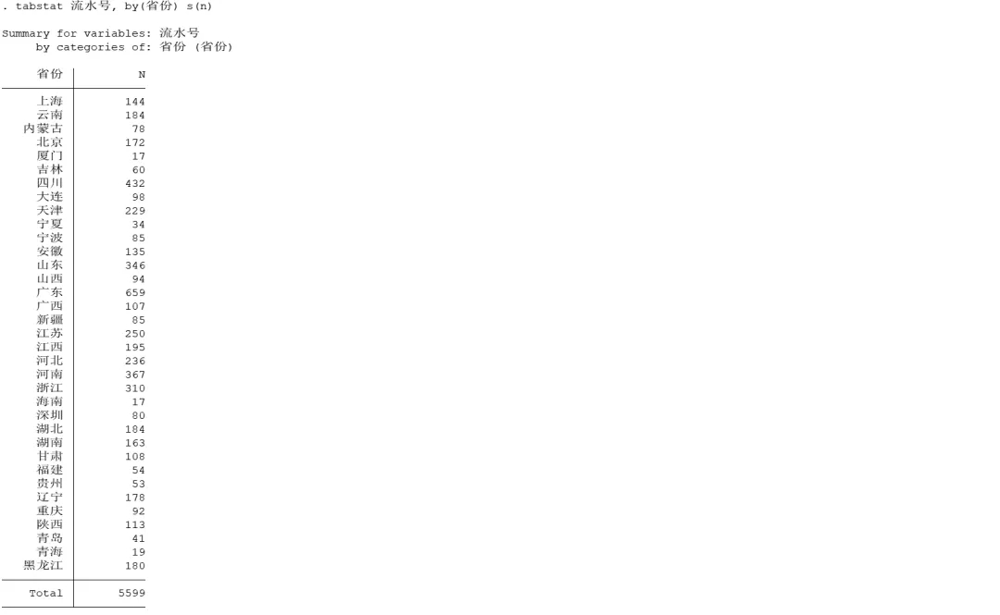
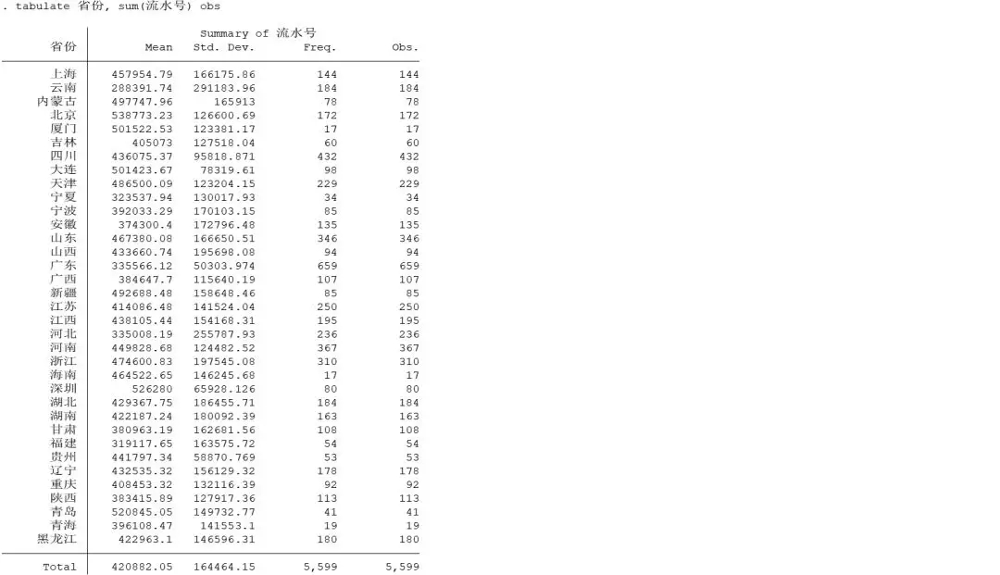
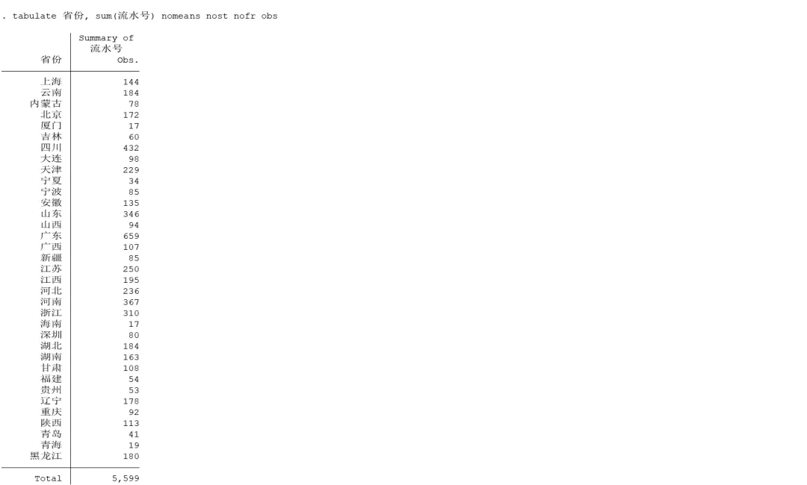
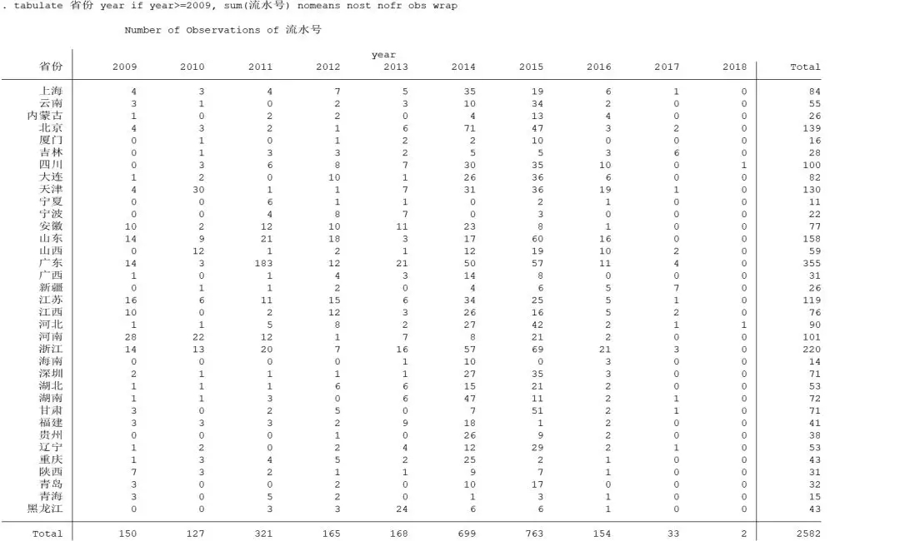
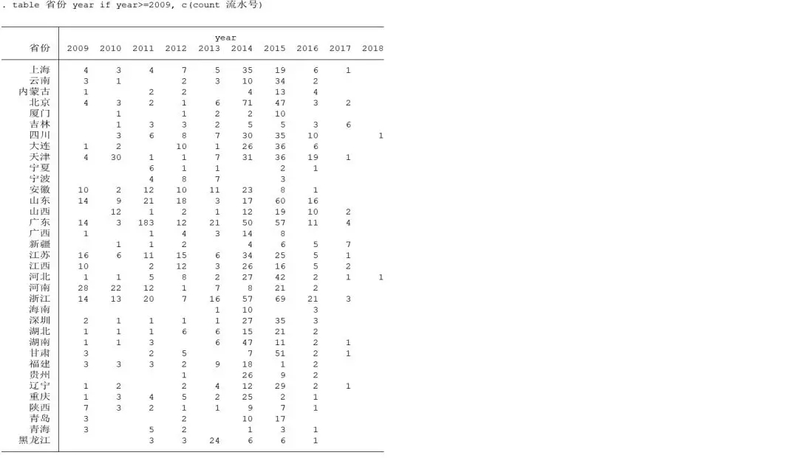
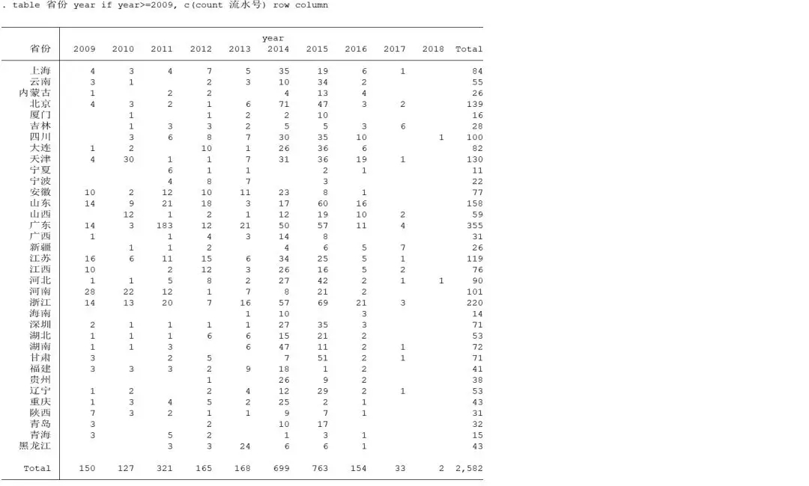

上一篇我们介绍了Stata中用于做透视表的`collapse`命令。这一篇我们将介绍与此相关的另外三个命令：`tabstat`、`tabulate`以及`table`。

### 提要

[toc]

### 1. tabstat命令

需要再次说明的是，本文的示例均是在以下数据处理的基础上进行的：

```javascript
import excel "机构退出列表.xls", sheet("许可证情况导出") firstrow clear
drop 经度 纬度 机构地址
gen year = yofd(date(批准成立日期, "YMD"))
```

关于数据的说明可参照：-----

如果我们想用`tabstat`命令统计每个省份的银行数量，相应的操作为：

```javascript
tabstat 流水号, by(省份) s(n) 
```
选项`s()`是`statistics()`的缩写，用于指定统计指标；`n`（同`count`）表示用于统计个数。

结果如下：



需要说明的是，`tabstat`只能按照一个变量进行分组统计（比如只能按照省份或年份进行统计），如果你非要按照两个变量进行分组统计，可以采用以下方法：

```javascript
bysort year: tabstat 流水号, by(省份) s(n) 
```

不过它的显示并不友好，特别是用于分组的变量组别非常多的时候，因此并不推荐。

### 2. tabulate命令

`tabulate`命令也可以用于一维、二维表格的统计，它可以简写为`ta`。

同样，按省份统计：
```javascript
tabulate 省份, sum(流水号) obs
```

结果如下：



注意该命令的用法，`tabulate`命令后面跟用于分组的变量名，选项`sum()`表示`summarize()`用于指定统计的变量，默认的统计结果包括均值、标准差和频数。`obs`用于指定统计出现的个数。

如果我们只想在结果中出现个数，而不想出现其他统计值，可以附加`nomeans`、`nost`及`nofr`:

```javascript
tabulate 省份, sum(流水号) nomeans nost nofr obs
```
结果如下：



如果想按照省份和年份两个变量进行统计，操作如下：

```javascript
tabulate 省份 year, sum(流水号) nomeans nost nofr obs //too many values
```

但是对于我们这份数据来说，省份和年份都太多，因此上述命令会出现`too many values`异常。因此我们选择只统计2009年之后的数据：

```javascript
tabulate 省份 year if year>=2009, sum(流水号) nomeans nost nofr obs wrap
```

选项`wrap`用于使显示的结果更加紧凑，尽量不断行显示。结果如下：



### 3. table命令

`table`命令也可以很方便地进行数据的统计――它的显示形式就更像Excel中的透视表了。

我们按照省份和年份进行统计：

```javascript
table 省份 year if year>=2009, c(count 流水号)
```

与`tabulate`命令不同，即使我们不限定`if year>=2009`也没有问题，但是显示的结果太多，反而显得凌乱，因此我们才限定只统计2009年之后的。

选项`c()`是`contents()`的缩写，用于指定生成表格中所填的内容，`count 流水号`就表示，生成的表格为`流水号`的个数。

结果如下：



如果我们还想要显示行列总和，可以附加`row`和`column`选项：

```javascript
table 省份 year if year>=2009, c(count 流水号) row column
```
结果如下：



几乎跟Excel做出来的透视表一样了。

###  4. 总结

结合上一篇我们总共介绍了四个关于对数据进行分组统计或者透视表操作的命令：`collapse`、`tabstat`、`tabulate`及`table`，这些命令的各有千秋。

`collapse`命令会改变当前内存中的数据，如果你就是想获取统计后的数据，而非那些原始数据，那么就用`collapse`吧。

另外的三条命令都不会改变内存中的数据，如果你只是想了解一下数据的分布或其他统计特征，那么就用这三条命令。

在这里，特别推荐使用`table`命令。它可以根据多个变量（最多3个）进行分组统计，且统计指标指标也非常多（包括频数、均值、标准差、总和、计数、中位数、分位数、最大值、最小值等等），最后显示出来的结果也非常紧凑漂亮――颜值也是战斗力――所以我们墙裂推荐。
