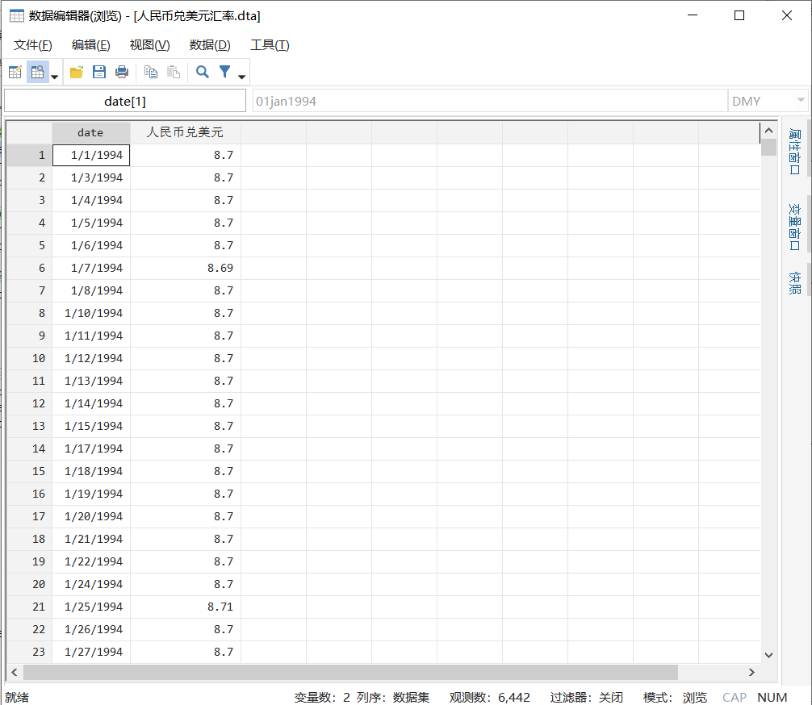
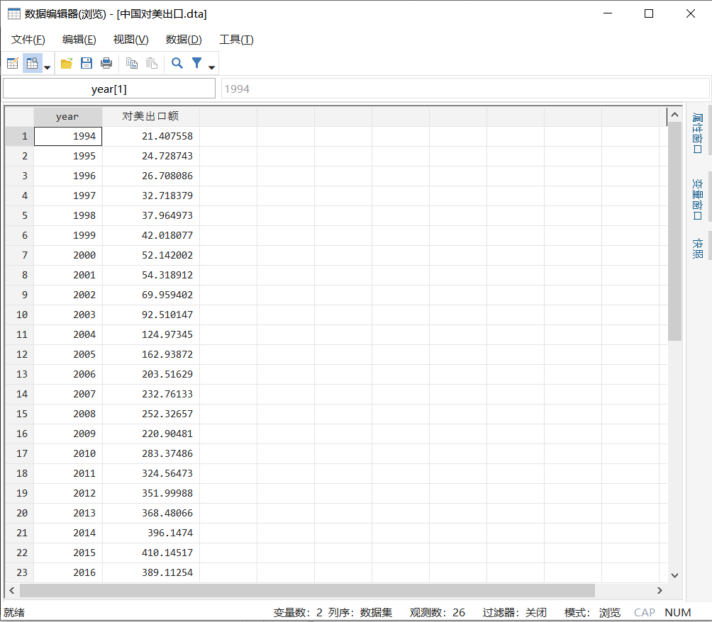
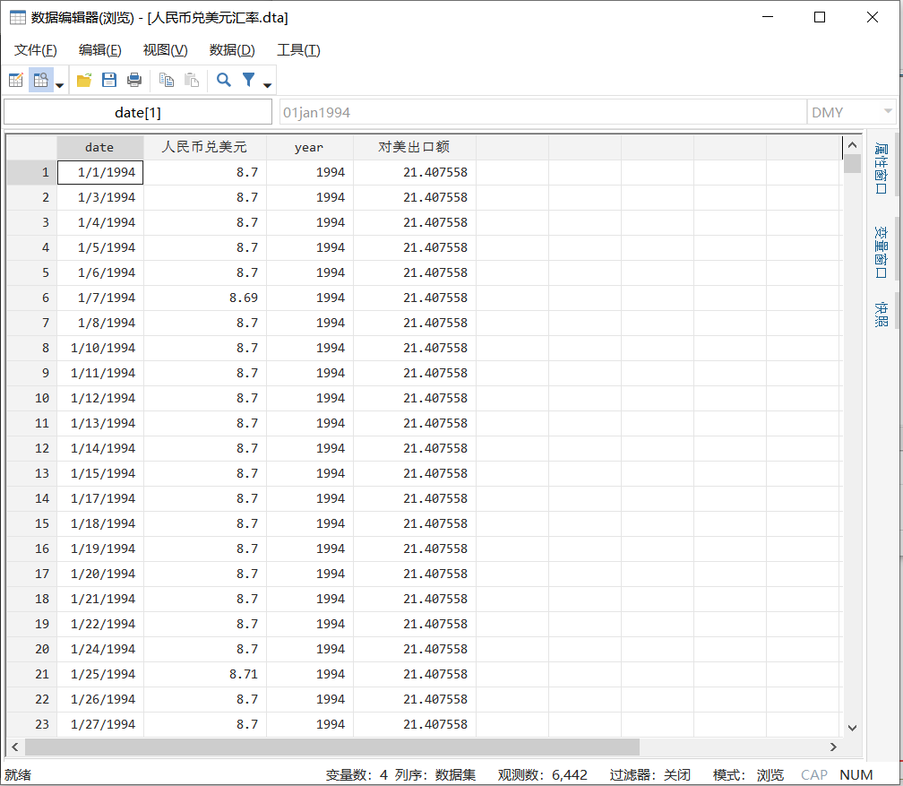
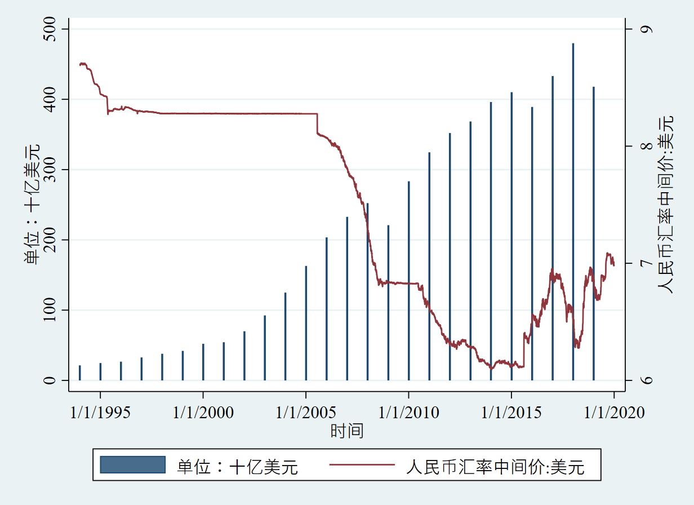
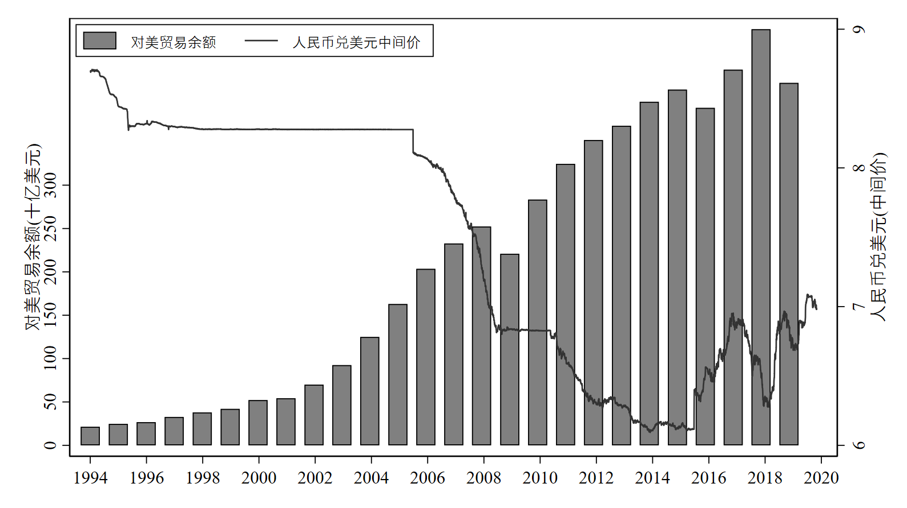

一个图像里面绘制两套数据是非常常见的，但多数情况是这两套数据拥有相同的x轴（比如都是年度数据），那么不同x轴的数据（比如年度数据和日度数据）如何绘制到一幅图中呢？

### 提要

[toc]

### 1. Stata绘制双轴图

之前我们介绍过很多Stata绘图的小技巧（没看过的可以翻一翻公众号的历史记录），今天我们介绍如何将不同x轴的数据绘制到一幅图中。

先看数据：

这是人民币兑美元的日度数据：



这是中国对美出口的年度数据：



如何将其绘制在一起呢？先合并数据：

```c
// 数据合并
use 人民币兑美元汇率.dta, clear
gen year = yofd(date)  // 生成year变量
merge m:1 year using 中国对美出口.dta, nogen
```
结果如下：



可以看到，一年有多少个交易日，就有多少个相同的`对美出口额`。

然后，每年只保留第一个`对美出口额`:

```c
// 贸易值每年只保留第一个
gen tag = 对美出口额[_n] - 对美出口额[_n-1]  // 对数据进行差分
replace 对美出口额 = . if tag==0			// 每一年只保留第一个值
```

接下来我们初步绘图：

```c
// 绘图
twoway (bar 对美出口额 date) ///
       (line 人民币兑美元 date, yaxis(2))
```
结果如下：



可以看到基本像个样子。

### 2. 图片精装修

这样的图片显然是拿不出手的。我们进一步对图片进行精装修：

```c
format date %tdCCYY
#delimit ;
twoway (bar 对美出口额 date, barw(250) lc(black) ) 
       (line 人民币兑美元 date, yaxis(2) lc(black*0.8)),
	xtitle("")
	ytitle("对美贸易余额(十亿美元)")
	ytitle("人民币兑美元(中间价)", axis(2))
	ylabel(0(50)300)
	xlabel(`=td(1/1/1994)'(735)`=td(1/12/2019)')
	legend(label(1 对美贸易余额) label(2 人民币兑美元中间价)
		   symxsize(*0.5) size(*0.8) ring(0) pos(11))
	xsize(16)
	ysize(9)
	scheme(s1mono)
	;
#delimit cr
```

结果如下：



恩，还行！

对上述代码略加说明：

第1行，将变量`date`的形式从`1jan1994`变成`1994`这样的形式，即只保留年份，这样在最后的x轴上就只有年份；

第3行，`barw()`即柱形的宽度，默认为1，即1个单位的宽度。一年有365天，但真正的交易日大概260天左右，为了让柱形粗一点，这里设置为250；

第9行，`td(1/1/1994)`即“1/1/1994”对应的数字；一年有365天，为了在坐标轴上每2年标一个刻度，那么间隔就应该是365*2=730，当然避免闰年可以稍微设大一点，这里为735；最后结束日期为“1/12/2019”。至于````=td()'```就是我们之间介绍过暂元的用法。

第12-13行，设置图片的尺寸为16*9。


