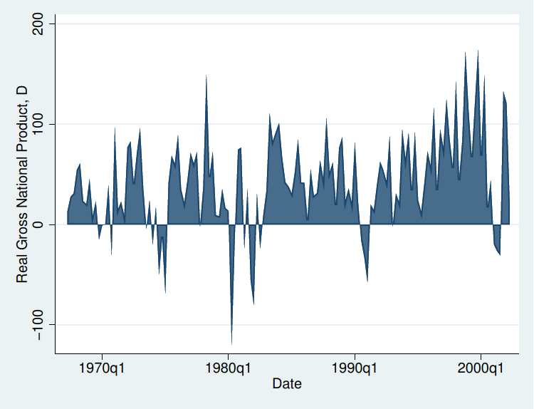
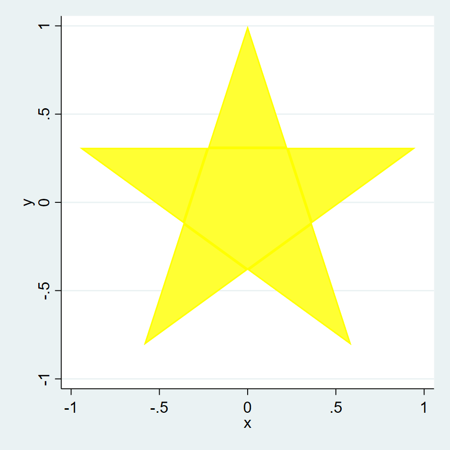
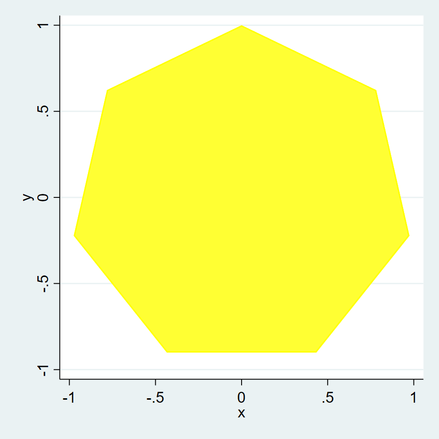
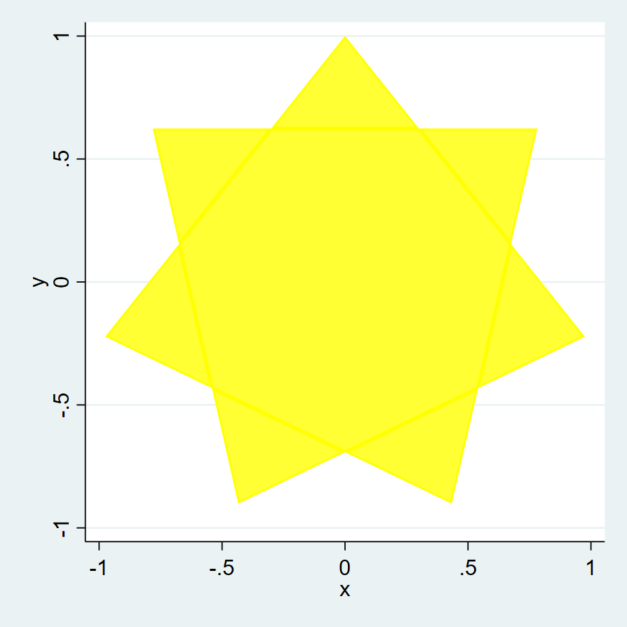
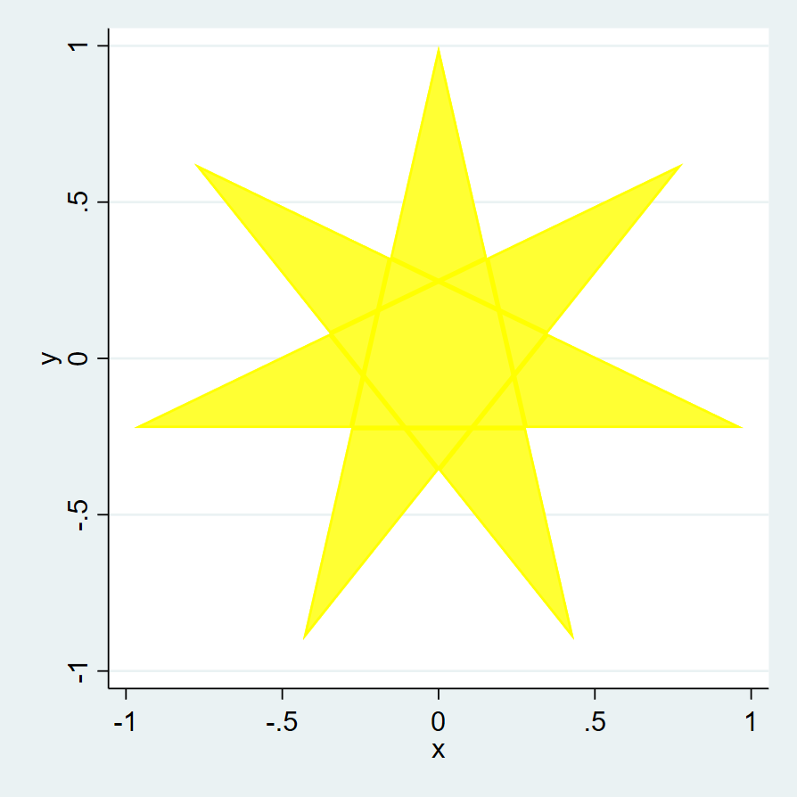
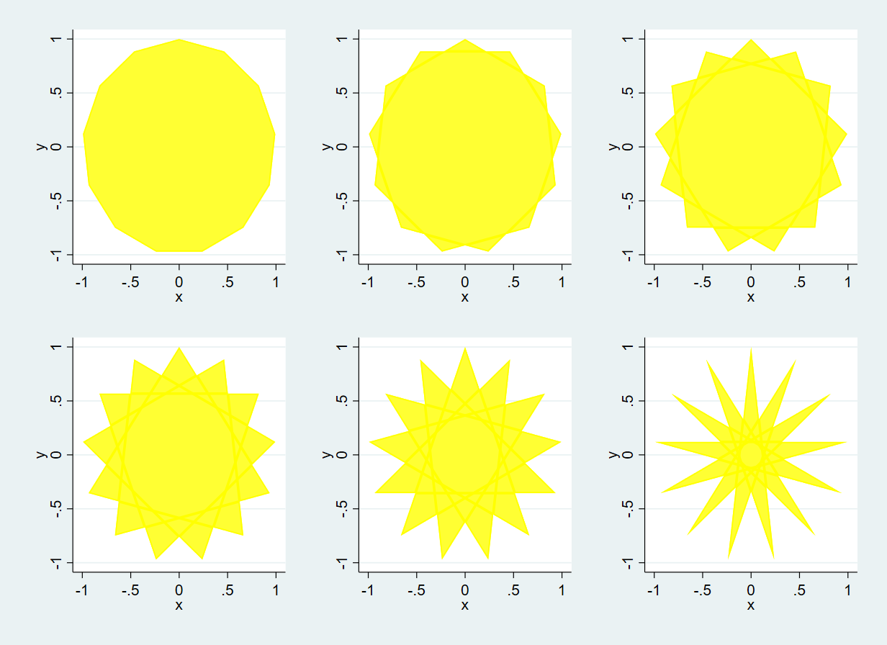

这一篇我们介绍Stata中一个基本绘图命令`twoway area`，它的能力超乎你想象！

### 提要

[toc]

### 1. 基本用法

`twoway area`命令是Stata中最基本的一条绘图命令，在之前的推文中我们已经介绍过了（传送门：）。

它的典型用法是绘制散点与x轴（或y轴）围成的区域图。如Stata Manual中所演示的：

```c
use "https://www.stata-press.com/data/r16/gnp96", clear
twoway area d.gnp96 date
```
然后得到结果：



这是它的基本用法，下面我们将使用它来绘制一些更加高端的图形。

### 2. 绘制五边形

在前面的例子中，`twoway area`用于绘制一些散点与坐标轴围成的区域图，但事实上，它也**可以按照散点的顺序绘制成封闭图形**。其中关键的一点是，**这些散点的起始坐标要和终点坐标相同**。

例如，绘制一个五边形。代码如下：

```c
clear
set obs 6
gen theta = 1 * (_n - 1) * (2*_pi)/5  // 将2pi等分为5
gen x = sin(theta)
gen y = cos(theta)

twoway area y x , xsize(10) ysize(10) color(yellow) nodropbase
```
五边形有五个点，但要绘制一个封闭的五边形，显然需要六个点。结果如下：


可以看出，`twoway area`依次连接6个点，从而形成一个封闭的五边形。

### 3. 绘制五芒星

五芒星，或者称之为五角星，它与前面五边形的点位坐标完全一样，只是连接的顺序不同而已。

大家可以试想一下如何一笔绘制一个五角星。当然是五点通过隔一个点连接而成的啦。

代码如下：

```c
clear
set obs 6
gen theta = 2 * (_n - 1) * (2*_pi)/5  // 这里与前面不同
gen x = sin(theta)
gen y = cos(theta)

twoway area y x , xsize(10) ysize(10) color(yellow) nodropbase
```

结果如下：



### 4. 绘制七芒星

同样的道理，绘制七边形：

```c
clear
set obs 8
gen theta = 1 * (_n - 1) * (2*_pi)/7
gen x = sin(theta)
gen y = cos(theta)

twoway area y x , xsize(10) ysize(10) color(yellow) nodropbase
```



绘制七芒星，隔一个点连接：
```c
clear
set obs 8
gen theta = 2 * (_n - 1) * (2*_pi)/7
gen x = sin(theta)
gen y = cos(theta)

twoway area y x , xsize(10) ysize(10) color(yellow) nodropbase
```



七芒星，隔两个点连接：
```
clear
set obs 8
gen theta = 3 * (_n - 1) * (2*_pi)/7
gen x = sin(theta)
gen y = cos(theta)

twoway area y x , xsize(10) ysize(10) color(yellow) nodropbase 
```



### 5.绘制十三芒星

同样的道理，我们绘制十三芒星：

```c
forvalues i = 1(1)6{
	clear
	set obs 14
	gen theta = `i' * (_n - 1) * (2*_pi)/13
	gen x = sin(theta)
	gen y = cos(theta)

	twoway area y x , xsize(10) ysize(10) color(yellow) nodropbase
	graph save graph`i', replace
}

graph combine graph1.gph graph2.gph graph3.gph ///
			  graph4.gph graph5.gph graph6.gph
```
结果如下：



以上就是我们初步使用`twoway area`绘制的一些漂亮图形，下一篇我们将用它来绘制更复杂的图形。拭目以待。