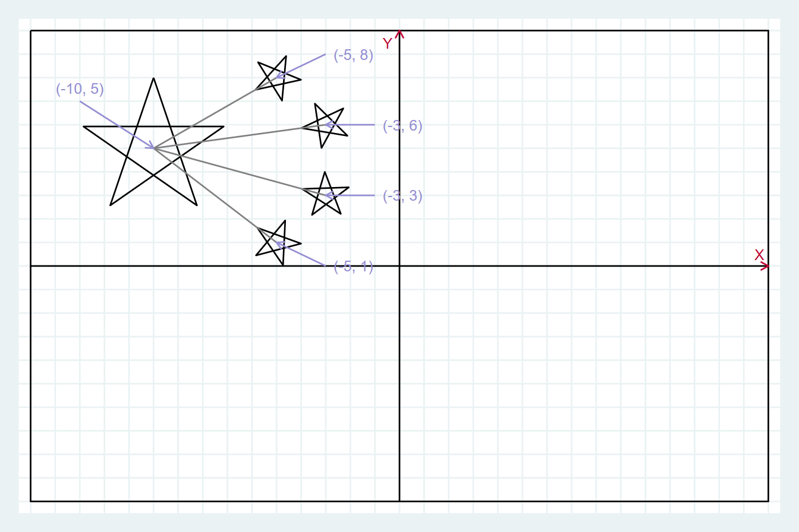
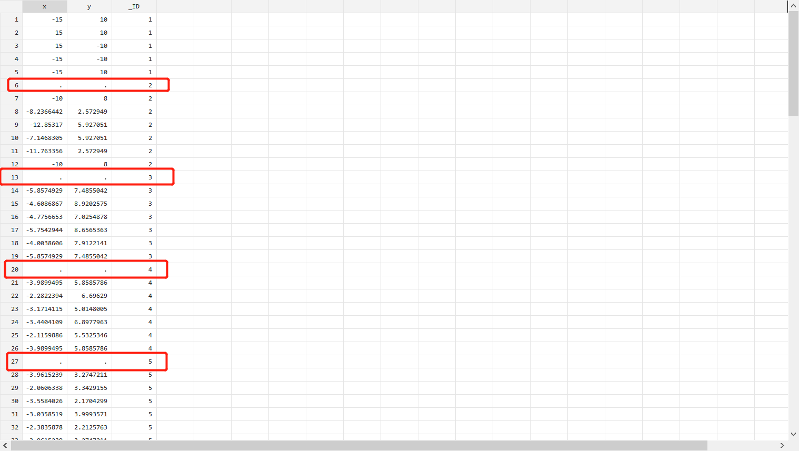
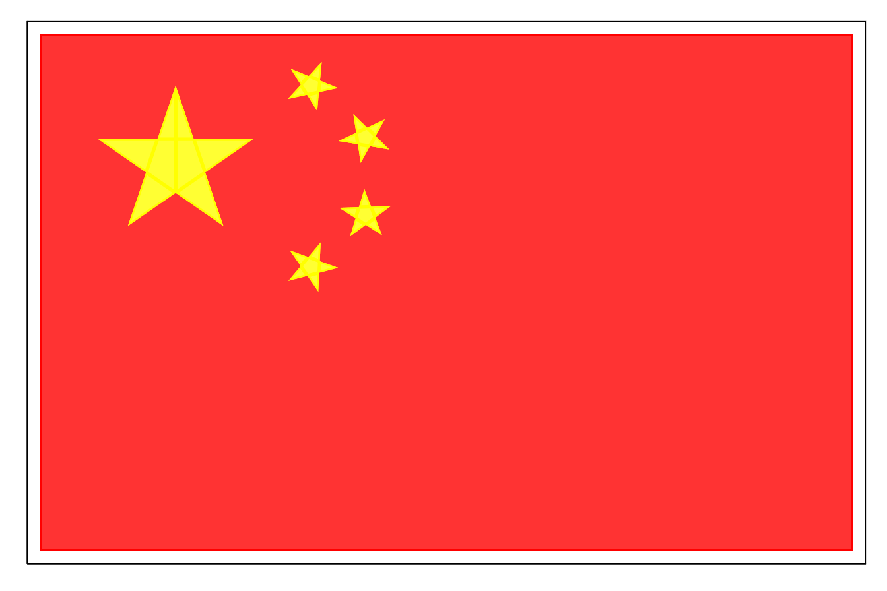
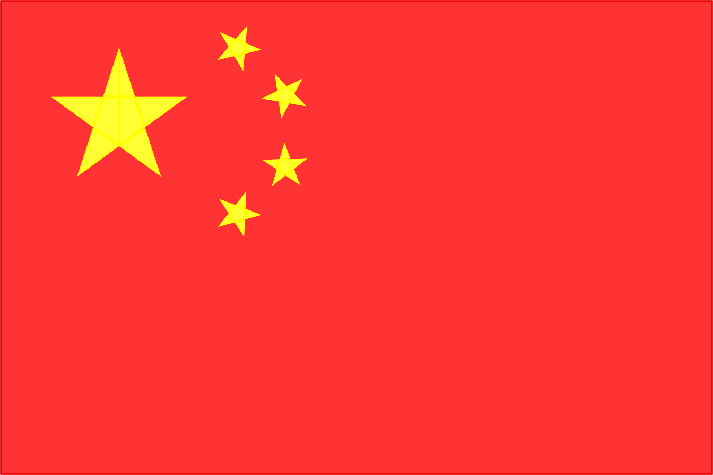

这是Stata绘图命令`twoway area`的第二弹。

前面我们已经介绍了Stata绘制国旗的一种方法（传送门：）以及`twoway area`的非典型用法（传送门：）。这一篇我们将完全使用`twoway area`绘制一面精美的五星红旗。

### 提要

[toc]

### 1. 坐标的计算

一般来说，国旗的绘制过程中需要注意三点：



**一是国旗的比例和尺寸。**国旗的长宽比为3:2，在这里我们设置国旗的长为30个单位，宽为20个单位；

**二是五角星中心坐标。**如上图，我们已经标示出了五颗五角星的中心坐标。大五角星的中心坐标为`(-10, 5)`，其余小星的中心坐标为`(-5, 8)`，`(-3, 6)`，`(-3, 3)`，`(-5, 1)`。

**三是四颗小五角星要有一个角朝向大五角星的中心。**

好了，基于以上要点，我们开始计算各个要素的坐标。

代码如下：

```c
clear
set obs 100
gen x = .
gen y = .
gen _ID = .

// 红色背景
replace x = -15 in 1
replace y =  10 in 1
replace x =  15 in 2
replace y =  10 in 2
replace x =  15 in 3
replace y = -10 in 3
replace x = -15 in 4
replace y = -10 in 4
replace x = -15 in 5
replace y =  10 in 5
replace _ID = 1 in 1/5
```

第2~5行，我们先设置观察值个数为100，然后生成变量`x`，`y`表示上述元素的坐标，`_ID`用来表示不同的元素。

第8~17行，用来计算红色背景的坐标。背景是一个矩形，共有4个顶点，要使其成为一个封闭图形，则需要5个点。第5个点和第1个点坐标要完全一致。

第18行，上述5点的`_ID`赋值为1。

**然后是大五角星的坐标：**

```c
// 大五角星（中心点(-10, 5),半径为3）
forvalues i = 1/6{
	local theta = (`i' - 1) * 4 * _pi / 5
	local k = `i' + 6
	
	replace x = 3*sin(`theta') - 10 in `k'
	replace y = 3*cos(`theta') + 5  in `k'
}
replace _ID = 2 in 6/12
```
在上一篇文章中（传送门：==）我们已经介绍过五角星的绘制过程，在此就不赘述了。

**最后是小五角星的坐标：**

```c
// 第一颗小五角星（中心点(-5, 8), 半径为1）
forvalues i = 1/6{
	local theta = (`i' - 1) * 4 * _pi / 5 - (_pi - atan(5/3))
	local k = `i' + 13
	
	replace x = sin(`theta') - 5 in `k'
	replace y = cos(`theta') + 8  in `k'
}
replace _ID = 3 in 13/19

// 第二颗小五角星（中心点(-3, 6), 半径为1）
forvalues i = 1/6{
	local theta = (`i' - 1) * 4 * _pi / 5 - (_pi - atan(7))
	local k = `i' + 20
	
	replace x = sin(`theta') - 3 in `k'
	replace y = cos(`theta') + 6  in `k'
}
replace _ID = 4 in 20/26

// 第三颗小五角星（中心点(-3, 3), 半径为1）
forvalues i = 1/6{
	local theta = (`i' - 1) * 4 * _pi / 5 - atan(7/2)
	local k = `i' + 27
	
	replace x = sin(`theta') - 3 in `k'
	replace y = cos(`theta') + 3  in `k'
}
replace _ID = 5 in 27/33

// 第四颗小五角星（中心点(-5, 1), 半径为1）
forvalues i = 1/6{
	local theta = (`i' - 1) * 4 * _pi / 5 - atan(5/4)
	local k = `i' + 34
	
	replace x = sin(`theta') - 5 in `k'
	replace y = cos(`theta') + 1  in `k'
}
replace _ID = 6 in 34/40
```

小五角星坐标的生成与大五角星原理基本相同。但需要注意的是，**小五角星**要有一个角冲向大五角星中心。因此必须将小五角星进行旋转。

以第四颗小五角星为例，其中心坐标为`(-5, 1)`, 大五角星中心坐标为`(-10, 5)`，因此需要将小五角星旋转$\arctan(\frac{-5 - (-10)}{5 - 1})$,即$\arctan(5/4)$。

因此在生成`theta`时要减去这个角度。

然后就生成如下数据：



这里需要注意的是，每一类元素的坐标之间我们都使用了缺漏值`.`来进行填充。关于这些缺漏值的妙用，后面会介绍。

### 2. 绘制国旗

下面我们将完全使用`twoway area`绘制国旗。

```c
#delimit ;
	twoway (area y x if _ID==1, color(red))
		   (area y x if _ID==2, color(yellow))
		   (area y x if _ID==3, color(yellow))
		   (area y x if _ID==4, color(yellow))
		   (area y x if _ID==5, color(yellow))
		   (area y x if _ID==6, color(yellow)),
	xsize(15) ysize(10) 		// 设置图形尺寸
	xlabel(none) ylabel(none)	// 不显示轴标签
	xtitle("") ytitle("") 		// 不显示轴名称
	legend(off) scheme(s1color) // 关闭图例
	;
#delimit cr
```

这时候，你就会发现我们生成`_ID`变量的用处了。结果如下：



### 3. 再升级

上述绘制五颗五角星的代码完全一致，是否可以将其合并呢？当然可以！

这就需要使用`cmiss()`选项了，代码如下：

```c
// 使用cmiss()选项
#delimit ;
	twoway (area y x if _ID==1, cmiss(n) color(red))
		   (area y x if _ID>=2, cmiss(n) color(yellow)),
		xsize(15) ysize(10) 
		xlabel(none) ylabel(none)
		xtitle("") ytitle("") 
		xscale(off) yscale(off) // 不显示坐标轴
		graphr(margin(zero)) 	// 图形区Margin为0
		plotr(margin(zero)) 	// 绘图区Margin为0
		legend(off) scheme(s1color)
	;
#delimit cr
```

`cmiss()`选项用于设定遇到缺失值时不强制画出间隙，使用了参数`n`，就代表No，即遇到缺失值时强制产生空隙。

更通俗一点讲，一个平面上有若干个点，如果不产生空隙，就是按照这些点的顺序依次进行连接，过程中笔不能离开桌面，也就是一笔成画。

而如果产生空隙，就表示，笔可以暂时的离开桌面，然后寻找下一个点继续绘制，即多笔成画。

这也就是我们为什么要生成那些缺失值的原因。

此外，我们将绘图区的margin设为0，绘制的国旗将更加纯粹。结果如下：



### 4. 一点补充

至此，使用`twoway area`绘制国旗已经完成。现在我们补充第1幅国旗草图的绘制方法：

```c
#delimit ;
	twoway (line y x,  cmiss(n) lcolor(black))
		   (pci 5 -10 8 -5, lcolor(gray))
		   (pci 5 -10 6 -3, lcolor(gray))
		   (pci 5 -10 3 -3, lcolor(gray))
		   (pci 5 -10 1 -5, lcolor(gray))
		   (pcarrowi -10 0 10 0  (8)  "Y"
					 0 -15 0 15  (11) "X", 
					 headlabel lcolor(black)) // 绘制坐标轴
		   (pcarrowi 7 -13 5 -10 (12) "(-10, 5)"
				     9 -3  8 -5  (3)  "(-5, 8)"
				     6 -1  6 -3  (3)  "(-3, 6)"
				     3 -1  3 -3  (3)  "(-3, 3)"
				     0 -3  1 -5  (3)  "(-5, 1)") // 添加五角星中心坐标
		,
		xsize(15) ysize(10)	xscale(off) yscale(off)
		xlabel(-15(1)15, grid) ylabel(-10(1)10, grid ang(0))
		xtitle("") ytitle("") legend(off)
	;
#delimit cr
```

如果你觉得使用`twoway area`不过就只能绘制一些更复杂了图形，只能称得上雕虫小技、奇技淫巧而已，那就大错特错了。

下一篇，我们将介绍`twoway area`的更高端用法，相信一定可以惊艳到你，请拭目以待！