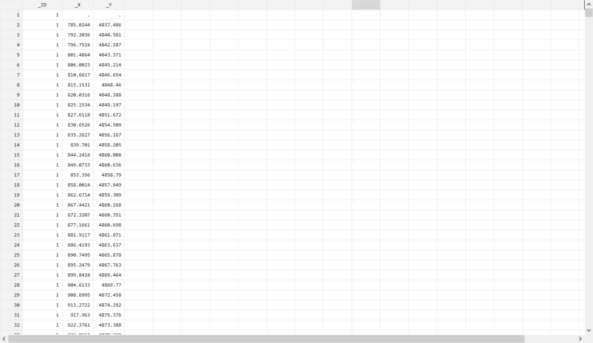
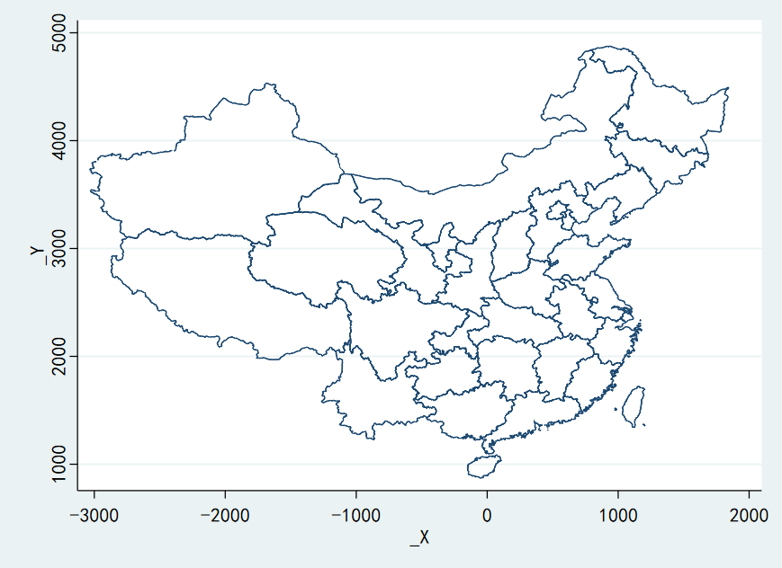
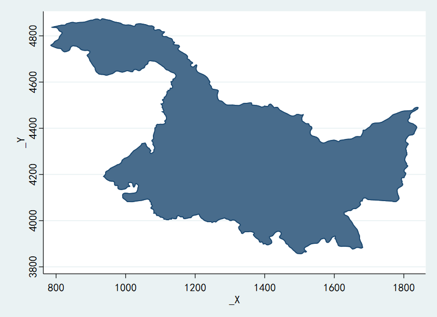
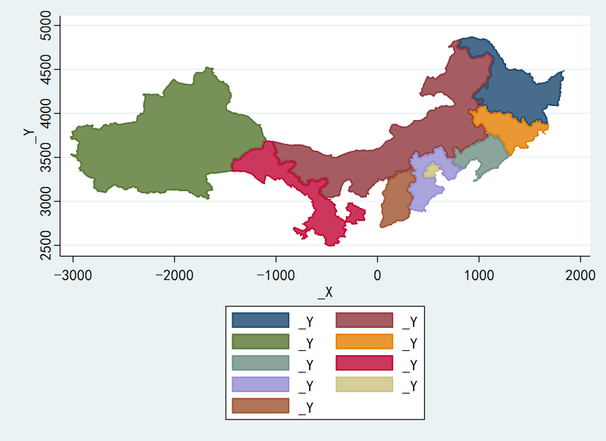
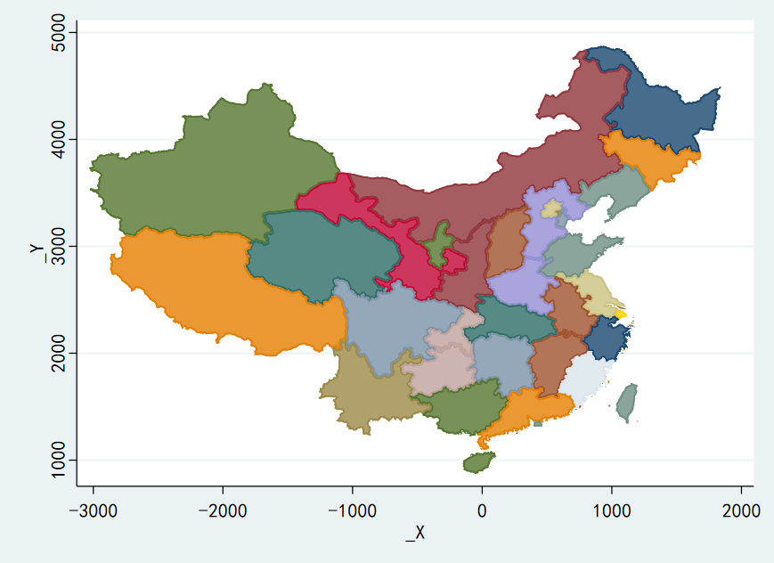

这是Stata绘图命令`twoway area`的第三弹。

我们已经在之前的文章中铺垫了很多关于`twoway area`的用法。它看起来是那么酷炫，但似乎毫无用处。这一篇我们将使用`twoway area`命令绘制地图，同时解密Stata中用于绘制地图命令——`spmap`——的原理。

在开始之前，你可参考一下文章：

[Stata绘图之twoway area（一）：绘制芒星](../twoway_area_1/readme.md)

[Stata绘图之twoway area（二）：绘制国旗](../twoway_area_2/readme.md)

### 提要

[toc]


### 1. 地图坐标数据

我们在之前的推文中已经介绍过了Stata中地图的绘制过程，相信大家已有所涉猎。在Stata中绘制地图，需要两份数据：一是地图的坐标数据。它用来标定地图的各个地区的坐标或者经纬度。二是你所要要绘制的一些数据，比如各个省份的人口密度、各个城市的平均气温等。这两份数据通过某一个变量（如`_ID`）关联。从而使人们可以方便地绘制出地图。

我已经将一份中国各省份地图的坐标数据上传至我的**`github`**上了，通过设置以下参数，可以从Stata中直接调用该数据。

```c
// 设置参数
global github "https://raw.githubusercontent.com/zhangdashenqi"
webuse set "${github}/the_zen_of_stata/master/data"

//载入数据
webuse china_map.dta, clear
br
```
这份坐标数据就是这个摸样：



想一下，**与我们之前绘制芒星和国旗时的数据是不是一个样？！**

常规操作，绘制散点：

```c
scatter _Y _X, msize(vtiny)
```



### 2. 绘制一个省

在这份坐标数据中，`_ID = 1`对应为黑龙江省，如果你看过之前的推文，相信可以对于下面的操作并不陌生：

```c
twoway (area _Y _X if _ID==1, nodropbase)
```

这个就是我们使用`twoway area`绘制一个省份，与之前绘制芒星和国旗并无不同。一切都是水到渠成！

结果如下：



那么相对应地，绘制多个省份的代码如下:

```c
#delimit ;
	twoway (area _Y _X if _ID==1, nodropbase)
		   (area _Y _X if _ID==2, nodropbase)
		   (area _Y _X if _ID==3, nodropbase)
		   (area _Y _X if _ID==4, nodropbase)
		   (area _Y _X if _ID==5, nodropbase)
		   (area _Y _X if _ID==6, nodropbase)
		   (area _Y _X if _ID==7, nodropbase)
		   (area _Y _X if _ID==8, nodropbase)
		   (area _Y _X if _ID==9, nodropbase)
	;
#delimit cr
```
结果如下：



### 3. 绘制一份完整的地图

在这份坐标数据中，`_ID`从1到66，你当然可以将上述代码重复66行，但是为了简洁美观起见，我们可以采用循环语句：

```c
local cmd ""
forvalues i = 1(1)66{
	local cmd0 "(area _Y _X if _ID==`i', nodropbase)"
	local cmd `cmd' `cmd0'
}
twoway `cmd', legend(off)
```

第2~5行，我们使用循环语句将那些重复的命令全部放到`cmd`这个局部暂元中。
第6行，绘制出全部地图，并且不显示图例。

结果如下：



可以看出，这已经是一个完整的地图了。只不过每个省份的颜色比较随机，没有具体含义。

事实上，Stata绘制地图的命令`spmap`就是基于`twoway area`命令进行封装的，感兴趣的同学可以学习一下它的源码。

`spmap`的作者Maurizio Pisati在代码中花费了大量的篇幅来定义地图上填充的颜色，以使不同的颜色表征不同范围的数值。

如果你有自定义地图的需要，完全可以使用`twoway area`绘制一幅你想要的地图！
