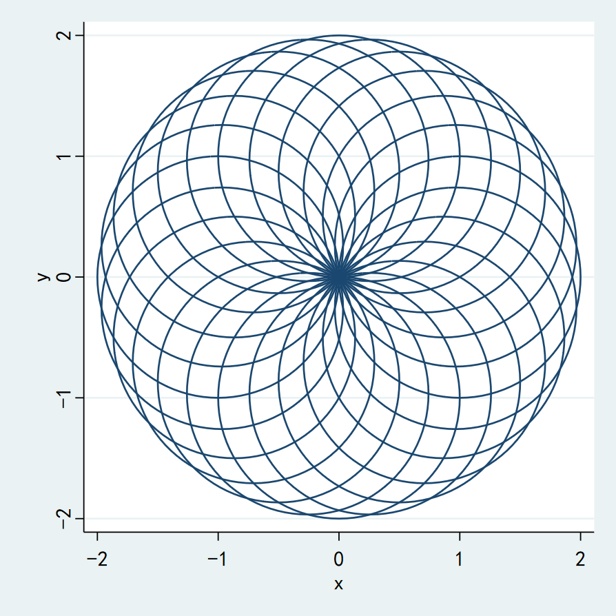
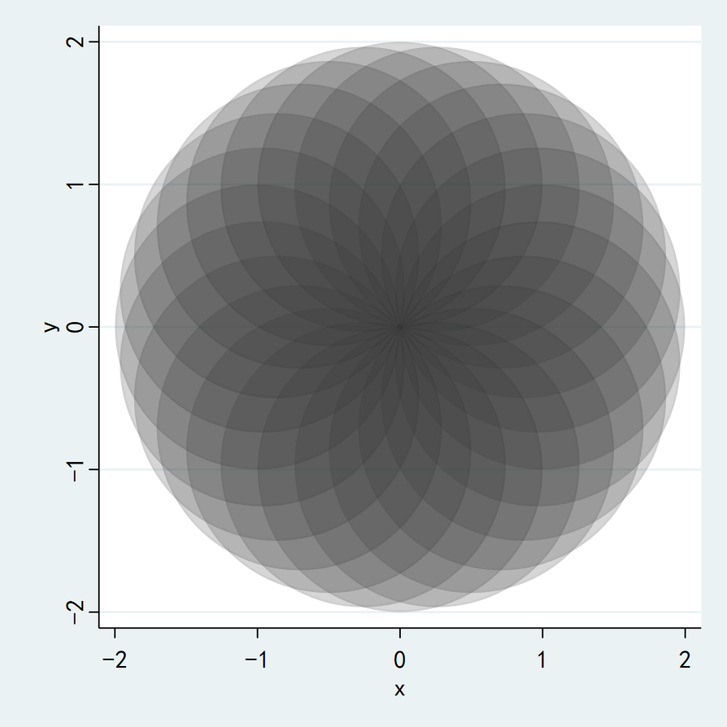
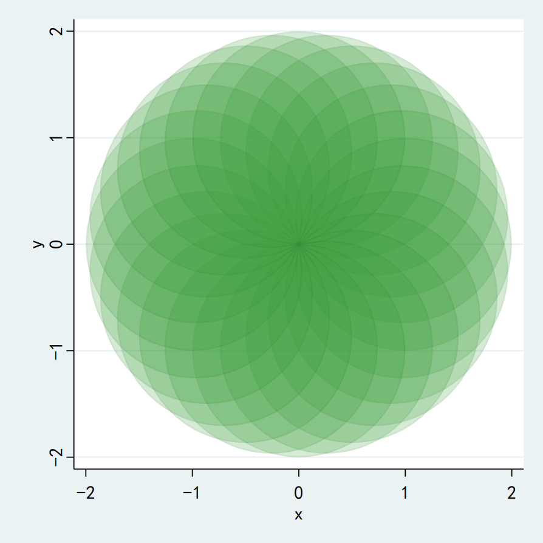

这是Stata绘图命令`twoway area`的第四弹。

在之前的文章中，我们介绍了`twoway area`的一些进阶用法，希望能给大家一些启发。

在这篇文章中，我们将介绍一个跟`twoway area`有类似用法的命令`twoway line`。

`twoway line`是Stata中常用的绘图命令，它的典型用法我们之前也已经介绍过了。但是，`twoway line`与`twoway area`一样，存在隐藏技能。

比如，绘制出如下图形：



这个是我们小学时候，刚学习圆规的时候画过的一个漂亮图案。它的画法是，先画一个圆，然后以相同半径，以圆弧上的点为圆心，密集画圆。

代码如下：
```c
clear
set obs 101
gen theta = _n * 2*_pi/100
gen x = sin(theta)
gen y = cos(theta)

insobs 10000 // 插入10000个观察值

// 将一个圆分为n份，然后以每个分割点为圆心画圆
// n尽量要能被360整除，比如18,24,30,36等
local n = 24 
forvalues i = 1(1)`n'{
	local start = `i'*100 + 2*`i' + 1
	local end = `start' + 100
	local x0 = sin(`i'/`n' * 2*_pi)
	local y0 = cos(`i'/`n' * 2*_pi)
	replace theta = (_n - `start' - 1)*2*_pi/100 in `start'/`end'
	replace x = `x0' + sin(theta) in `start'/`end'
	replace y = `y0' + cos(theta) in `start'/`end'
}

twoway (line y x in 102/-1, cmiss(n) nodropbase), xsize(10) ysize(10)
```
第11行的`n`就是我们定义在圆弧上画圆的个数。
第22行，我们使用`twoway line`将这些点连接起来，形成一个精美的图案。

当然，也可以用`twoway area`绘制：
```c
twoway (area y x in 102/-1, cmiss(n) nodropbase ///
	lcolor(black%3) fcolor(black%20)), xsize(10) ysize(10) 
```
第2行的`fcolor(black%20)`用于设定填充颜色为黑色，20%的透明度。

结果如下：



换个颜色：
```c
twoway (area y x in 102/-1, cmiss(n) nodropbase ///
	lcolor(black%3) fcolor(green%20)), xsize(10) ysize(10) 
```



`twoway area`和`twoway line`是Stata中常用的绘图命令，但它们也是隐藏最深的命令。

希望这一系列的文章能使大家对于Stata绘图有更加深刻的理解。同时，可以结合这些基础命令，创造出更加复杂的绘图命令。